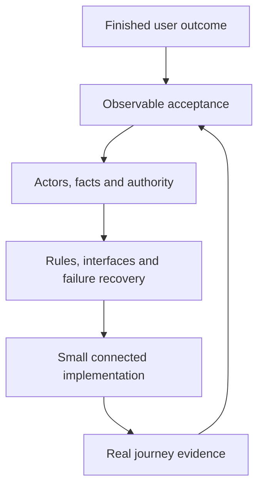

# AuxiliumOS master build map

## The finished operating outcome

A person enters OS and immediately understands the work they can perform, the context they are acting in, the next responsible person and the evidence behind the current state. A client can request and authorize appropriate work, receive the right released output and ask a useful contextual question. Auxilium can review, coordinate and deliver that work without losing original information or expanding authority accidentally. Enterprise clients can maintain useful site knowledge and see accountable readiness, incidents, money, results and follow-up across permitted facilities.

Tools strengthen these workflows. Their outputs retain provenance, belong to the correct context and pass through the same review and audience controls. Independent Moldo work continues without OS. Spatial retains its shared full editor, independently accessible hosting and the separately verified native capture path. Runtime AI, if activated under its existing decision, assists the workflow while humans retain professional and commercial authority.

This outcome is the reason for the maps. Page count, form count, draft text and test totals cannot substitute for it. Source: `repo:docs/01-product/END_STATE_BLUEPRINT.md`, `repo:REQUIREMENTS.json`, `baseline:01-product/PRODUCT_CONSTITUTION.md`.

## Work backward, then build forward

For example, start with “the permitted client can retrieve the exact released report.” Work backward to current recipient authority, release/version binding, required human review, content integrity and safe upload. The UI must present the right title/version/next action and a recoverable failure. Build and prove that chain using the existing document implementation. Do not build unrelated new document features to fill an architecture diagram.

A complete map has no orphaned outcome: each capability points to a source requirement, its producer and consumer contracts, its state and failure rules, and an acceptance path. A complete implementation additionally needs working code and matching evidence in the actual target environment. Designing the maps is not evidence that the runtime has met them.

## One owner for each requirement

| Map | Accountable product modules | Shared responsibility |
| --- | --- | --- |
| MAP-01 Platform, backend and security | M01 Core; M19 Audit | C01 identity/isolation; common identity, policy, audit and recovery primitives |
| MAP-02 User experience | No separate business module; supplies the common experience for all 20 | C05 usability/accessibility; shell, navigation, context, component/action patterns and visual review |
| MAP-03 Professional workflows | M07 Intake; M08 Scope; M09 Sampling; M12 Operations | C03 controlled authority; professional workflow rules and effective amendments |
| MAP-04 Commercial authority | M10 ROM; M11 Agreements/Authorization; M15 Vendors; M16 Finance | Commercial delegation, exact commitments and qualified assigned work |
| MAP-05 Enterprise/readiness/reporting | M02 Accounts; M03 Programs/MSA; M04 Portfolios; M05 Assets/Facilities; M06 Readiness; M17 Reporting/QBR | Stable relationship/site truth, optional enterprise context and source-backed oversight |
| MAP-06 Evidence/communications/AI | M13 Documents; M14 Communications; M18 AI | C02 document integrity; C07 no-PHI/runtime AI; content lifecycle and contextual assistance |
| MAP-07 Tools/integrations | M20 Integrations | C06 Moldo independence; tool source ownership, Spatial delivery and scoped adapters |
| MAP-08 Verification/release/operations | No additional product module | C04 resilience/lifecycle acceptance; GOV-001 durable continuation; review, evidence and release coordination |

Accountability means someone must close the criterion. It does not mean that person can change another map's contract or privately own every related file. `coverage/ACCEPTANCE_OWNERSHIP.json` assigns all 163 exact criteria and gives collaborators. Semantic file custody, a temporary task allocation and deployment authority are separate concerns.

## The shared spine

The existing relationship map remains: Client Account; optional Program/MSA and Portfolio; Asset/Facility and Zone/Area; optional Incident and distinct Project Request; Scope Record; Authorization; Project; Tasks/Work Orders; Deliverables; Documents; Communications; Financial Records; Reports/Dashboards; Audit Events.

These are not mandatory wizard steps. The schema must preserve the actual relationship, not require an invented portfolio, incident or project for every simple task. Sampling and ROM remain owning modules linked to scope and authorization. Shared reference/configuration, rules/templates and integration/system records support the spine without becoming unapproved commercial objects.

The following boundaries must survive every implementation:

- Identity, active membership, scoped capability, professional qualification and commercial delegation are distinct.
- Original requests and measured facts remain separate from reviewed classification, scope and interpretation.
- Approved scope, effective authorization, signed terms and released files bind exact preserved revisions. Valid amendments have explicit effective behavior.
- A local edit, saved personal planning note, server-accepted domain change, review approval and audience release are different facts.
- Preservation hold and visibility restriction are independent.
- A source record owns its truth; dashboards and integrations project only authorized information.

Sources: `repo:docs/01-product/DATA_SPINE.md`; `repo:docs/03-data/ADR-001-DOMAIN-AND-MOLDO-BOUNDARIES.md`; the owning domain contracts in each map.

## Interfaces connect the maps

`contracts/INTERFACE_REGISTER.json` names 20 logical handoffs. Each has one producer, named consumers, mandatory semantics, failure behavior and acceptance. These labels are documentation references, not newly implemented API endpoints, message queues or database tables.

An interface is ready for a task when the relevant request/result schema, actor/context rule, revision/state behavior, failure semantics and verification examples are pinned to actual source. Existing implemented interfaces may already supply that detail. New work only specifies the missing part needed for the next outcome. Do not block a known UI defect while designing unrelated future integrations.

The producer proposes a change; affected consumers review it; the integrator records the accepted revision and allocates implementation. A compatibility-breaking change cannot silently land in one map. Business dependency diagrams may contain feedback loops, such as a field observation generating a scope amendment. The implementation slice graph must remain executable and free of circular prerequisites.

## Delivery proceeds through useful journeys

| Outcome | Producer work | Consumer work | Evidence that closes the handoff |
| --- | --- | --- | --- |
| Stable sign-in and useful work context | MAP-01 identity/access; MAP-05 directory | MAP-02 shell, context, forms | Authorized context survives normal navigation/revalidation; revoked access still denies |
| Request reaches the right operator | MAP-03 intake/triage | MAP-02 client/internal surfaces; MAP-06 response routing | Original preserved; submission/readback; next owner/action; scoped denied paths |
| Reviewed work becomes validly authorized | MAP-03 scope/sampling; MAP-04 ROM/agreement | MAP-03 project mobilization; MAP-02 review/decision UI | Exact revisions, real authority, prerequisites, expiry and safe retries |
| Field work produces a trusted client output | MAP-03 execution; MAP-07 tools; MAP-06 documents | MAP-02 operator/client surfaces; MAP-05 site history | Source provenance, human review, exact recipient bytes, replacement/withdrawal |
| Enterprise team acts on useful information | MAP-05 site/program/readiness/reporting; MAP-04 finance | Audience-specific work and executive views | Current source, defined metrics, unknowns visible, accountable actions and scoped exports |

MAP-08 participates throughout. It is not a late cleanup team. Domain workers write their affected tests and return evidence; MAP-08 reviews evidence scope and shared gates. MAP-02 reviews the shared experience while domain workers own allocated feature screens. MAP-01 reviews security and shared data effects while domain workers own allocated domain implementation.

## First practical work

The previous audit identifies existing source and known gaps. Refresh actual state before writes because other work may have advanced. Do not treat its pins as the latest remote commit by default.

1. The lead reconciles GitHub/Lovable/backend/Spatial source and active writers. Preserve both document-control work and newer Spatial work. Update existing live masters, not this frozen package.
2. Allocate the four unsaved-work failure paths and authorized context/pagination to a bounded shared experience repair, with MAP-01 security review. Reuse the existing reproduction evidence to target the work.
3. Close the real hosted identity/private-document/release acceptance gap using the current implemented controls. A skipped hosted job remains a missing claim; it does not justify rewriting completed source.
4. Integrate the first role-appropriate request and document journeys using actual domain records and exact next actions.
5. Progress through scope/sampling, commercial authority and execution, while independent directory/enterprise and adapter contract work proceeds on settled interfaces.

`coverage/IMPLEMENTATION_SLICES.json` supplies bounded proposals mapped to the existing queue. Initial readiness is conditional on fresh source readback; the package does not dispatch work or claim a task is currently running.

## Useful as soon as possible without losing scope

The complete launch still preserves every existing acceptance criterion. Earlier usefulness comes from completing a coherent, explicitly bounded journey, not silently removing modules. Demonstrate a synthetic end-to-end path first; use real data only when the affected operational and owner gates are met. If the owner later chooses a restricted live pilot, name its actors/data/allowed actions and outstanding full-scope work. This map does not declare that pilot already approved.

Do not defer the UI until the backend is “all finished.” Do not design the UI independently of authority and persistence. Agree the small contract for the selected journey, implement the consuming experience and owning behavior together, and verify their connection. That is the shortest reliable path to something useful.

## Improving after the original plan

Capture a candidate only when it solves an observed problem or advances an explicit outcome. State who benefits, the evidence, the smallest change, affected contracts, new authority/data implications and acceptance. Prioritize defects and usability/performance improvements inside the original scope now. Keep optional new capabilities outside the committed launch scope until deliberately accepted. No new feature list is invented here.

## Adoption and reference syntax

`repo:path` resolves to `reference/sources/canonical/path` in this package and to `path` in the actual repository. `baseline:path` resolves to `reference/path`. `spatial:path` resolves to `reference/sources/spatial/path`. Exact source pins and limitations remain in the embedded source register.

Proposed live documentation home: `docs/11-launch/build-maps/`. Adjust reference links when adopting. Keep `REQUIREMENTS.json`, `BUILD_QUEUE.json`, `BUILD_STATE.json`, `OWNER_DECISIONS.json` and `VERIFICATION_PROFILES.json` as live masters. The new coverage and slice files are reference/adoption proposals. Regenerate or revise them when the controlling source changes; do not let a second status database develop.
