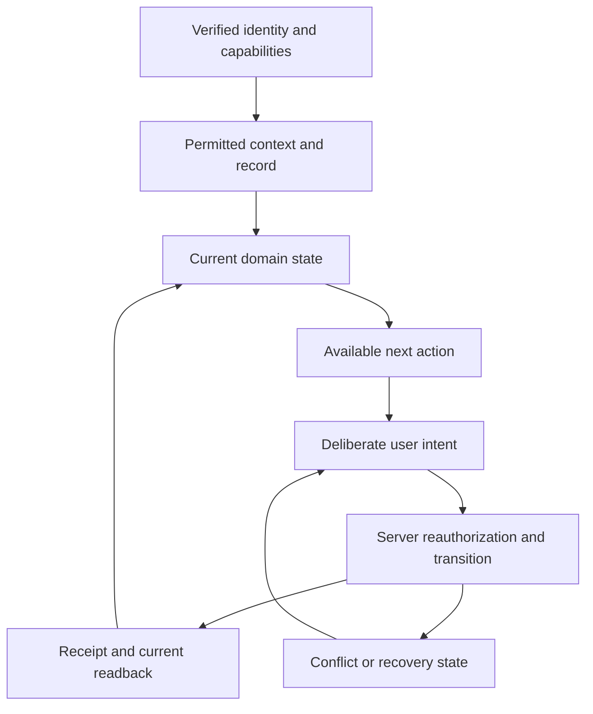

# MAP-02: User experience and shared interface

**Purpose:** make the entire authorized OS understandable and usable as one operating system. This map owns shared presentation and interaction contracts, not the business authority of every screen. Domain maps implement their own feature interfaces using this contract. Primary requirement: C05. Consumers: M01–M20.

**Edition:** 2026-10-09, America/Chicago. Source baseline: `148d74d9720f0799e5d845bb789cd3fc3f43feb8`. This is a development map, not evidence that the target is implemented. `repo:` references resolve within `reference/sources/canonical/`; `baseline:` references resolve within `reference/`. Refresh the actual repository and assigned file ownership before implementation. The dated audit is reusable evidence about the pinned source, not a fresh observation of later source or today's hosted application.

## 1. Work backward from the experience that must exist

The finished product lets each authorized party answer five questions without understanding the implementation: **What needs my attention? What work or facility is this about? What is currently true? What can I do next? What happened after I did it?**

Work backward in this order:

1. Define the actual successful user outcome and audience.
2. Identify the permitted next action and its owning domain transition.
3. Identify the real record, context, current state, required input and exact revision behind that action.
4. Identify the provider contract, failure/recovery states and proof needed.
5. Build the smallest complete path through those steps, then extend the proven pattern to the rest of the original scope.

This order does not reduce the twenty-module destination. It prevents disconnected screen creation. A module card, mock chart or saved planning note does not complete the domain workflow it describes.

| Desired end outcome | Required UI experience | Provider of the truth | What cannot substitute |
|---|---|---|---|
| Client knows what happens next | Own request/project, current client-facing state, named next actor, exact required decision | MAP-03 operations; MAP-04 authorization; IF-01/02/08 | Generic links titled “Next actions” |
| Facility team maintains useful knowledge | Permitted facility details, gaps, evidence freshness, action owner and review date | MAP-05; IF-04/12 | An unreviewed checklist or a green score with unknown inputs |
| Auxilium completes work without retyping | One verified context carried through intake, scope, authorization, work, evidence and release | MAP-01/03/04/05/06 | A separate text reference field in each module |
| Reviewer makes a defensible decision | Actual exact revision, material changes, qualifications/assignment and deliberate decision | MAP-03/06; IF-06/09 | A checkbox called reviewed or a later mutable draft |
| Vendor completes only assigned work | Minimal permitted assignment, instructions, due date, evidence submission and response | MAP-04; IF-11 | General access to the account or internal workspace |
| Leadership understands value and exposure | Defined metrics, date range, known/unknown state and source drill-down | MAP-05; IF-12 | Decorative dashboards or assumed zero values |
| Tool makes work easier | Focused workspace, known context/save state and exact-version handoff | MAP-07; IF-15/16/17 | A tool iframe/menu entry with no durable linkage |

Source authority: `repo:docs/01-product/END_STATE_BLUEPRINT.md`, `repo:docs/01-product/PRODUCT_PRINCIPLES.md`, `baseline:01-product/PRODUCT_CONSTITUTION.md`, `baseline:02-experience/CRITICAL_USER_JOURNEYS.md`.

## 2. Scope and present baseline

Current source includes a real React shell, authenticated directory/intake components, private synthetic planning persistence, document controls and a Spatial host. Preserve their working protections. The four audience wrappers exist but have no active route consumer. Most module tabs use preparation forms, not their eventual domain contracts. All twenty modules remain planned in `REQUIREMENTS.json`; source presence is not full acceptance.

The prior audit found eighteen UI defects/gaps. Four local synthetic-browser observations reproduced loss of unsaved work: replacing with an example; choosing required account/facility context; background/foreground visibility revalidation; and leaving/returning through in-app navigation. It also measured the Scope context selector at y=1,289 and draft preparation at y=1,679 on a 390 × 844 viewport while horizontal-overflow checks passed. These findings justify interaction repairs before further mass screen generation.

Evidence: `baseline:02-experience/UI_AUDIT.md`, `baseline:02-experience/evidence/browser-observations.json`, `baseline:02-experience/evidence/reproduction/audit.spec.ts`, `baseline:02-experience/UI_ROUTE_ACTION_MATRIX.json`. This evidence uses a synthetic HTTP fixture, not real backend permissions or a physical phone. The Documents screenshot contains a fixture-caused unavailable response, not proof of an outage.

The canonical source and hosted source differed at the prior audit. Use `baseline:00-reconciliation/LOVABLE_SOURCE_COMPARISON.json` before transferring UI work. Preserve the newer Spatial source independently. Never solve visual inconsistency by overwriting all files with the older archive or a fresh generated theme.

## 3. The user interface is a consumer of authority

No presentation audience, hidden button, route identifier, client checkbox or optimistic status supplies authority. The UI can simplify what a person sees; IF-01/02 and the owning domain must enforce who may actually read and mutate. The canonical spine is a relationship/provenance structure, not a mandatory seventeen-step wizard. Programs/portfolios remain optional where their controlling rules allow.

### IF-18: logical UI view/action contract

This is a **target contract**, not an existing API declaration. Prefer typed adapters over renaming stable backend fields. The integrator approves the exact TypeScript shape once; feature maps consume the agreed shape.

| Element | Required information | Provider and consumer rule |
|---|---|---|
| Context | Verified account; optional program, portfolio, facility/area and work object IDs; readable labels; verification/freshness state | IF-01 validates identity/scope; IF-04/05/08 supplies object relationships. A URL is a request to resolve, never evidence of access. |
| View identity | Module/object kind, stable record ID, exact revision where relevant, record title, permitted audience | Owning map resolves the source record; MAP-02 renders consistent identity. No second parallel “UI record” store. |
| State | Domain state plus independent read/edit/network state; observed revision/time; known/unknown value indicators | Domain owns state meaning. A generic green badge cannot manufacture success. |
| Next action | Stable action key; human label; current eligibility; concise blocker and responsible next actor; owning command | Eligibility is an observation. Every write rechecks current authority and versions. A permitted recipient label cannot be invented from text. |
| List projection | Display fields required for this audience; stable cursors; permitted filters/sorts; exact record/action link | Domain query returns only allowed records. Client pagination does not replace server filtering. No hidden totals or foreign-record names. |
| Edit intent | Verified context, editable fields, base revision, idempotency/request identity for consequential writes | Domain API supplies the exact supported intent. Freeze the complete intent at submit; do not mutate it after an uncertain response. |
| Receipt | Exact applied identity/revision and operation result; separate current readback status | A receipt is historical evidence. It is not a fresh permission check or a guarantee another user received the result. |
| Error/recovery | Typed unavailable/validation/conflict/uncertain/provider failure; safe next action; recoverable input where authorized | Raw provider messages, tokens and storage keys stay out of product copy. Recovery follows IF-20; access revocation takes precedence over continued display. |

Consumer integration is complete when a domain screen supplies these real values and an affected journey passes. It is not complete when every module imports a common component.

## 4. Audiences, navigation and contextual continuity

These are existing presentation audiences, not new permission roles. Actual people and live grants remain governed by existing owner decisions and MAP-01.

| Audience | Landing content | Default useful destinations | Required restrictions |
|---|---|---|---|
| Simple client | Required decisions; current requests/projects; next event; newly released material; questions awaiting response | Home; Requests/Projects; Documents; Messages; permitted Agreements/Billing | No internal drafts, general module catalog, internal notes or other accounts |
| Enterprise client | Simple-client work plus assigned facilities, gaps and accountable owners | Facilities/Portfolio; Readiness; permitted Incidents/Programs/Reporting | Assignment and audience control breadth; enterprise title alone does not grant everything |
| Internal team/management | Due, overdue, waiting and blocked work; assigned reviews; next responsible person | My Work; Intake; Projects; Accounts/Facilities; Review/Release; permitted commercial/oversight areas | Administration cannot imply technical, signing or release authority |
| Assigned vendor | Assigned work, due dates, evidence requests and closeout response | Assigned Work; permitted evidence/credentials | No unrelated vendors, general account library, internal or executive material |
| Client executive / Auxilium leadership | Separately permitted source-backed oversight views | Relevant portfolio/program/reporting and authorized actions | These two audiences are not interchangeable; titles do not create finance/signing/release grants |

Source: `repo:docs/06-ui/CLIENT_PORTAL_MAP.md`, `repo:docs/06-ui/ADMIN_CONSOLE_MAP.md`, `repo:docs/06-ui/VENDOR_PORTAL_MAP.md`, `repo:docs/06-ui/EXECUTIVE_PORTAL_MAP.md`.

Navigation has three distinct jobs: global destinations, current relationship context and task-specific next steps. Do not show five competing versions of the same navigation. Keep twenty modules discoverable in permitted reference/admin inventory without forcing twenty links into each person's everyday navigation.

### Route and context rules

| Situation | Required behavior | Failure to prevent |
|---|---|---|
| Open a permitted deep link beyond the first list page | Resolve that exact record independently, validate scope, load its context and selected action/tab | Treating “not in first 50” as nonexistent or unauthorized |
| Move from a facility to intake, scope, project or documents | Carry its account and facility plus the relevant existing object IDs; destination independently verifies each relationship | Dropping facility and asking user to recreate it |
| Browser Back from detail | Restore originating filters, cursor/page and useful scroll position where feasible | Returning to an unrelated account or blank search |
| Switch account/facility while editing | Invoke dirty-work handling before losing/reparenting input; confirm the new permitted context separately | An automatic React key remount discarding the draft |
| Permission changes during a request | Ignore late responses from the prior identity/scope; clear protected content on actual denial | Retaining stale protected data or rendering an old response over the new context |
| Open an attention item | Open its exact record, action/tab and allowed context | Routing to a general module landing page with the task lost |
| Search | Label module-name filtering as navigation; record search queries permitted records with supported filters | A module filter pretending to be global business search |
| Tool launch | Use verified context and handoff contract; retain return-to-work reference | A personal local workspace falsely described as a project-connected tool |

One route/label registry should control title, breadcrumb, nav label, module ID, audience eligibility and aliases. This is a presentation consolidation, not a new domain registry. Current `/` maps to Accounts while `/core` maps to Home; `/accounts` duplicates directory access; Assets redirects to Facilities; Documents is labeled Private files; Spatial is absent from `moduleForPath`. Choose the canonical landing route in the implementation packet, preserve compatible aliases and test incoming links. Do not silently change stable domain IDs or treat changing URLs as a feature completion.

UI names: use **Facility Coordinator**. Explain “Site Passport” as maintained facility information and evidence with owners/review dates. Never imply that its existence proves safety or compliance. Use US English and plain, useful copy.

## 5. Work-preserving editor and async state logic

### Editing transition table

The UI states below are presentation states, not new persisted business statuses. The domain owner defines safe storage/recovery under IF-20. Do not use indiscriminate localStorage or disable authorization rechecks to hide data loss.

| Before / trigger | UI behavior and permitted choices | Server/storage consequence | Required observation |
|---|---|---|---|
| No context / start a context-bound record | Resolve required context before the durable editor, or explicitly preserve provisional input until context is verified | No silent foreign reparenting; no domain record yet | User can select context without losing what the UI already allowed them to type |
| Clean / edit | Mark dirty; preserve base revision and source identity | No mutation until the supported save mechanism | “Unsaved” is not success green |
| Dirty / in-app navigation, Back, context switch, open other draft or sample | Offer continue editing, permitted save/recovery or deliberate discard as applicable; guard SPA transitions too | Preserve only data and recovery scope allowed by IF-20 | Four prior loss cases no longer erase authorized work |
| Dirty / ordinary background then foreground | Revalidate without unnecessary destructive subtree replacement; prevent new privileged actions until authority is known where needed | No permission extension; domain determines pending draft retention | Authorized draft survives return; revoked user cannot inspect it |
| Submitting / double click or timeout | Disable duplicate conflicting controls; keep exact frozen intent and operation identifier | Retry same original intent; never generate a second commitment silently | Single domain transition, exact receipt or explicit unresolved state |
| Saved / readback failed | Show saved result and unavailable latest copy separately | Preserve known receipt, fetch current state when possible | User is not induced to repeat a successful write |
| Dirty / base revision stale | Show conflict and latest permitted record; preserve proposed content; explicit revise/resubmit | No last-write-wins override of approvals or another person's work | Concurrent version survives; user can make a deliberate replacement |
| Pending / identity or scope revoked | Stop protected reads/actions and visible data immediately; provide a safe generic explanation | Follow authorized disposal/recovery policy; do not export hidden content to avoid loss | Revocation is enforced even though normal revalidation preserves work |
| Example requested / dirty draft | Create a separate explicit example draft or confirm replacement; reset sample-specific checks coherently | Synthetic planning only; no automatic domain adoption | Previous draft cannot be silently overwritten or carry stale checked review notes |
| Late async response / context changed | Abort where supported; discard mismatched identity/scope/revision response | No cross-context cache reuse | New context and new input remain intact |

Source anchors: `repo:web/src/lib/runtime.tsx`, `repo:web/src/router.tsx`, `repo:web/src/components/module-draft-screen.tsx`, `repo:web/src/components/plan-context.tsx`, `repo:web/src/lib/use-workspace-plans.ts`. MAP-01 owns session/recovery security; MAP-02 owns transition presentation; domain maps own saved record semantics.

### Shared visible state vocabulary

| State family | Product wording and presentation | Must not imply |
|---|---|---|
| Loading / refreshing | Reserve layout; label what is loading; retain still-authorized context; distinguish first load from refresh | Blank content is zero records; refresh is a signed-out user |
| Empty | Explain no records in this permitted scope; offer a valid create/filter action | Inaccessible records do not exist elsewhere |
| Not found or unavailable | Generic access/unavailable message; safe return or request appropriate help | Whether a foreign record exists |
| Validation | Field-specific message, linked summary, input preserved and focus routed | A failed client check proves server authorization |
| Unknown / unmeasured / unapproved | Explicit text and neutral/attention treatment as appropriate | Zero, safe, compliant, approved or complete |
| Waiting / blocked / overdue | Named dependency or next actor, due date where defined, route to action | A loading spinner or success badge |
| Unsaved / saving / saved | Describe exactly what is saved: personal note, scope revision, decision, message, etc. | Saving notes changes approved work |
| Conflict | Explain changed record and recovery choice | Automatic overwrite or silent approval carryover |
| Uncertain operation | Explain confirmation is pending; exact retry/status check | Definite failure, success or authorization from a historical receipt |
| Partial failure | Identify successful and unfinished children without losing their receipts | A whole package succeeded when a child did not |
| Service unavailable | Preserve authorized input, show bounded retry and support context | Infinite spinning, raw internals or a made-up completion estimate |

## 6. All twenty module surfaces, with domain ownership

The target column is required product behavior derived from existing scope. It is not a claim of current runtime readiness. Each owning map implements feature screens and APIs together. MAP-02 reviews common interaction conformance; it does not become a twenty-module coding bottleneck.

| Module / current path | Owning map and real data surface | Primary action / result | Critical UI distinction and dependency |
|---|---|---|---|
| M01 Core `/core` | MAP-01 truth; MAP-02 Home/shell | Open exact assigned work or permitted search result | Home is an operating queue, not the complete module catalog. Queue data comes from MAP-03, configuration/capability data from MAP-01. |
| M02 Accounts `/accounts` and `/` | MAP-05 account/contact/relationship detail | Select/create or maintain an authorized relationship | Account membership, contact identity and signer authority are separate. Do not grant authority through form labels. |
| M03 Programs/MSA `/programs` | MAP-05 program coverage/effective period | Inspect facility activation and relevant agreed coverage | Show active/effective terms, exclusions and missing activation. A program is not automatic project authorization. |
| M04 Portfolios `/portfolios` | MAP-05 optional account structure | View permitted facility collection and source-based roll-up | Do not require a portfolio for a simple client. A roll-up cannot reveal hidden children. |
| M05 Facilities `/assets`, `/facilities` | MAP-05 facility/zone/critical asset detail | Open site context, incident/request, evidence or approved tool | Verified searchable/paginated context; preserve facility through next action. |
| M06 Readiness `/readiness` | MAP-05 passport/gaps/actions/owners | Complete an assigned gap, review evidence or schedule approved recurring work | Readiness is maintained evidence, not a legal/scientific safety guarantee. Unknown input stays unknown. |
| M07 Intake `/intake` | MAP-03 distinct incident and project-request records | Submit/triage, request clarification, assign accountable next step | Incident is not request; request receipt does not accept work or approve scope. |
| M08 Scope `/scope` | MAP-03 exact scope versions, exclusions, assumptions, review | Draft/review/change a scope through authorized transitions | Typed reviewer/reference text is not authority. Approved version and proposed changes remain distinct. |
| M09 Sampling `/sampling` | MAP-03 plan, sample identifiers, COC and reviewed lab evidence | Record field evidence or seek qualified approval | No UI-generated scientific defaults. Observation, analytical result and professional conclusion remain separate. |
| M10 ROM `/estimates` | MAP-04 versioned assumptions/estimate | Prepare/compare estimate and request commercial decision | Estimate is not a quote, cap, commitment or authorization. Missing rates never become zero. |
| M11 Authorization `/approvals` | MAP-04 exact terms/scope/cap/payer/signer | Review/sign or request authorized change | Signer identity/authority independent from paying or viewing; a client message is not acceptance. |
| M12 Projects `/projects` | MAP-03 tasks, schedule, field evidence, blockers and closeout | Execute permitted task; assign next actor; resolve waiting work | Completion requires actual evidence/deliverable states, not all local checkboxes. Preserve linked authorization. |
| M13 Documents `/documents` | MAP-06 versions, review, release and permitted bytes | Inspect/review/release exact revision or open released document | Upload, safe handling, internal approval, audience release and delivered bytes are different states. |
| M14 Communications `/messages` | MAP-06 object-linked threads, response ownership and notifications | Ask/reply/route or create a change-request draft | A conversation cannot silently amend approved scope, sampling, cap, signed terms or release. |
| M15 Vendors `/vendors` | MAP-04 credentials, assignments and closeout | Assign permitted work or review submitted evidence | Credential expiry/eligibility separate from general contact; vendors see only assignment-allowed records. |
| M16 Finance `/finance` | MAP-04 commitment/cost/invoice/reserve views | Record/reconcile authorized commercial event | Visibility separated from technical contents; posted/estimated/unknown positions remain distinct. |
| M17 Reporting `/reports` | MAP-05 metric/source/period/audience and QBR | Inspect source or prepare/review exact reporting packet | No invented savings, compliance or value claims; export honors child permissions via MAP-06. |
| M18 AI `/ai` | MAP-06 bounded job/output/review work, activation-gated | Inspect sources and deliberately adopt/reject a permitted proposal | Runtime activation is unresolved; core work remains possible without AI. Do not present a preparation note as an executed job. |
| M19 Audit `/audit` | MAP-01 governed event query | Filter authorized events and inspect safe provenance | Current decorative filters are not an implemented query; UI never authors authoritative audit events. |
| M20 Integrations `/integrations` | MAP-07 adapter state/operations/reconciliation | Launch authorized tool or resolve a bounded failed operation | Connection status is not successful transfer; explicit action and useful recovery required. |

Spatial is a tool surface under MAP-07, not a twenty-first module. It gets a proper title/breadcrumb, focusable canvas controls, local versus project-bound save state and an explicit return/handoff. Its independent deployment and native-device work are separate from this shared-shell map. Moldo remains independently operated.

## 7. Components that are shared, and ones that should remain domain-specific

| Shared pattern | MAP-02 provides | Domain map provides |
|---|---|---|
| Workspace shell and context header | Layout, capability-filtered navigation renderer, focus/skip/return behavior, context selector adapter | Verified capabilities/audience and permitted context relationships |
| Work queue/list/detail | Table/card responsive anatomy, filters, pagination controls, selection/deep-link behavior | Query, ordering, allowed filters, source-defined owner/status/next action and cursor semantics |
| Record editor | Sections, field/error primitives, dirty-state controller, confirmation/recovery presentation | Typed fields, units, validation, domain picks, base version and durable save/submit |
| Exact-version review | Document/version/change/audience presentation and deliberate-action pattern | Exact version source, current reviewer/controller authority and actual transition |
| Communication panel | Thread, composer, response ownership and sending/failure patterns | Participants, object/version binding, send command, routing and delivery state |
| Tool wrapper | Focused available area, title/return/context, loading/unavailable shell | MAP-07 launch/save/handoff, tool controls and independent source ownership |
| Status and next-action presentation | Semantic tokens, text/icon, reason/next actor, error-summary behavior | Actual state meaning, current eligibility and prerequisite relationships |

Do not turn one enormous component into every workflow. `ModuleDraftScreen` can remain an honestly labeled preparation surface until deliberate adoption/migration. Preserve existing personal plans; they cannot be bulk-promoted into authoritative scopes, agreements, messages, reports or AI jobs. Source: `repo:docs/03-data/WORKSPACE_PLANS.md`.

Shared context fetching must avoid `PlanContextBar` and `useVerifiedFacility` issuing duplicate independent reads. Hidden tabs should not eagerly fetch three separate plan lists without user need. Cache only where the identity/scope/revision key and invalidation are correct; never use caching to bypass current authorization. MAP-05 supplies directory pagination/query semantics; MAP-02 supplies the shared picker UI.

## 8. Visual and interaction acceptance

Keep the existing direction: white/light surfaces, dark readable text, deep-blue navigation, restrained borders/spacing, consistent primary action and semantic state colors. The task does not authorize a new brand system. Preserve usable assets and tool visuals. Use progressive disclosure to place technical provenance behind the user-relevant record and action.

| Surface or condition | Acceptance observation |
|---|---|
| Narrow phone / ordinary phone / tablet / desktop | Record actual viewport/device. No accidental whole-page sideways scrolling. A deliberate data table or canvas scroll has clear containment. Primary task is reachable without scrolling through an unrelated sample narrative. |
| Software keyboard | Supported phone browser shows active field, errors and relevant save/next controls; fixed navigation does not cover content. A resized desktop screenshot is insufficient. |
| Long labels, names and identifiers | Wrap or truncate with accessible full value; no clipped actions or overlapping badges. Numeric/unit fields remain readable. |
| Keyboard | Skip link, visible focus, logical order, operable menus/tabs, proper dialog trapping and focus restoration; no focus in hidden tab panels. |
| Screen reader | Associated labels/descriptions, meaningful headings, validation summary and error/status announcements; current tab/selection state exposed. |
| Text enlargement / reduced motion | Task still usable with enlarged text; unnecessary motion is reduced; no forced animation that blocks reading or interaction. |
| Populated / empty / denied / conflict / unavailable | Actionable presentation preserves authorized entered work and safe context; no raw implementation internals in the main product flow. |
| Review/release | Title, purpose, exact version/date, changes and intended audience lead. Hashes/UUIDs/transport details are secondary diagnostics when useful. |

No-overflow assertions are useful regression checks, but complete one representative task and recovery per affected audience. Do not turn repeated screenshots or full-suite reruns into a replacement for implementation.

## 9. Trace every prior UI finding to a concrete repair

Finding IDs below retain the original audit identity. Do not mark them closed until changed-source evidence demonstrates the listed result.

| Finding | Repair owner and slice | Closure evidence |
|---|---|---|
| UI-01 Same navigation; unused audiences | MAP-02.S03 with MAP-01 capabilities | Each existing audience sees its permitted priorities/navigation; direct unauthorized routes still deny. |
| UI-02 Sample/planning content dominates work | MAP-02.S04 plus every domain feature slice | Real permitted task and context precede optional examples; feature action reaches its domain service. |
| UI-03 Navigation/context/visibility discards work | MAP-02.S01 with MAP-01 IF-20 | Three old loss paths retain authorized work; real revocation clears protected access. |
| UI-04 Loading sample silently replaces draft | MAP-02.S01 | Explicit separate example or discard/replace choice; review checks reset coherently. |
| UI-05 First-page-only context | MAP-02.S02 with MAP-05 IF-04 | Select/search beyond page one and open exact permitted deep link outside loaded page. |
| UI-06 Context lost between modules | MAP-02.S02 | Facility-to-task-to-detail-to-Back retains verified related context and list state. |
| UI-07 Generic next actions; weak deep links | MAP-02.S03 with MAP-03 IF-08 | Queue item opens exact assigned action with supported filters/tab/context. |
| UI-08 Free text impersonates relationships | Owning MAP-03/04/05/06 feature slice; MAP-02.S04 pattern | Permitted domain picker and server relationship/authority check; text cannot grant action. |
| UI-09 Repeated navigation and misleading spine strip | MAP-02.S03 | One clear global navigation/context/next-step model; canonical spine remains source truth. |
| UI-10 Route/label drift | MAP-02.S02 | Registry parity of title/breadcrumb/nav; tested aliases; Spatial labeled correctly. |
| UI-11 Document internals dominate; metadata not bytes | MAP-06 with MAP-02.S04 | Readable document/review UI; genuine recipient-content outcome separately verified. |
| UI-12 Success styling on unknown/unsaved/gap | MAP-02.S04 | Semantic state tests/screens for success, unknown, pending, unsaved, error and gap. |
| UI-13 Inconsistent sample case and inferred revisions | MAP-02.S05 plus domain fixture owners | Exact fixture lineage across scope/authorization/project/vendor/document; no regex-derived authority. |
| UI-14 Decorative audit/integration/AI controls | MAP-01/06/07 consumers of MAP-02.S04 | Real governed query/action or concise honest unavailable state; no fake live controls. |
| UI-15 Spatial not independent/project-bound | MAP-07 with MAP-02.S06 | Clear current namespace; correct launch/title/canvas; independent deploy and governed handoff proven by MAP-07. |
| UI-16 Overflow checks insufficient | MAP-02.S06 with MAP-08 | Supported device task/keyboard/recovery evidence, plus accessibility and layout checks. |
| UI-17 Duplicate queries/eager hidden panels | MAP-02.S02/S04 with MAP-05 | One verified context resolution; inactive panels do not load redundant data; revocation invalidation retained. |
| UI-18 Catalog drift/unused components/obsolete tests | MAP-02.S04/S05 with MAP-08 | Referenced registry contracts reconciled; obsolete paths removed/labeled after reference search; actual React runtime tests. |

## 10. Bounded slices and parallel delivery

These are proposed child work packages, not a replacement for `BUILD_QUEUE.json`. The integrator assigns them to the actual queue, commits and exclusive files. Do not start a whole-map rewrite in one unbounded chat.

| Slice | Inputs and dependency | Owned deliverable | Completion boundary |
|---|---|---|---|
| MAP-02.S01 Protect entered work | Existing four reproducible cases; MAP-01 IF-20 draft/security contract | Dirty transitions, sample replacement, safe revalidation integration | Four old loss paths fixed; uncertainty/concurrent edits/revocation checked; no disabled security rechecks. |
| MAP-02.S02 Unified context and routes | IF-01/02/04; agreed context/route shape | Shared picker, exact resolution, pagination/search, route/title aliases and safe return | Large permitted directory and wrong-scope link checks; context survives related navigation. |
| MAP-02.S03 Role-appropriate Home/navigation | IF-02 capabilities and IF-08 queue projection; S02 | Active audience layout, real next-action links, simplified navigation | Representative internal/client/vendor/enterprise task opens correctly; no capability inflation. |
| MAP-02.S04 Shared patterns and real-domain adoption | S01–S03; provider adapters for ready domain slices | Semantic statuses, list/editor/review patterns, optional examples, domain-owned feature adoption | At least one real vertical journey uses patterns; remaining modules use same contract as implemented, not pretend-live placeholders. |
| MAP-02.S05 Coherent demo and catalog cleanup | Domain-owned synthetic fixture relationships; S04 | Explicit demonstration path and exact fixture lineage; remove/labeled obsolete UI paths | Fixture demonstrates truthful linked states; sample actions cannot silently mutate real records; module inventory retains all twenty. |
| MAP-02.S06 Supported-device and tool handoff acceptance | Implemented affected flows; MAP-07 handoff; MAP-08 evidence rules | Focused phone/desktop/keyboard proof and remediations | End-to-end tasks and recovery pass with declared backend mode; no claim of physical/native tool acceptance from web screenshots. |

After IF-18 is agreed, MAP-03/04/05/06/07 can independently build their feature pages within exclusive paths. MAP-02 reviews contract compatibility and shared behavior once per meaningful change. A feature-specific visual adjustment does not require the UI chat to rewrite another map's files. A shared-component change triggers affected consumer checks, not all twenty full workflows automatically.

## 11. Exact write ownership and shared-file boundaries

This table is a proposed allocation for the integration lead to approve per work packet. Existing files are not globally locked forever; only one writer receives any given path at a time. New folder names are reserved proposals, not claims that those files currently exist.

| Path or area | Sole writer / rule |
|---|---|
| `web/src/router.tsx`, `web/src/components/app-shell.tsx`, `web/src/components/audience-layouts.tsx`, `web/src/pages/home.tsx`, `web/src/lib/modules.ts`, `web/src/styles.css` | MAP-02 worker only while exclusively allocated; integrator reviews routes/imports/global styles and merges. Domain workers request narrow changes through a recorded contract delta. |
| `web/src/components/plan-context.tsx` and proposed shared context/status/list/editor presentation files | MAP-02; provider semantics reviewed by MAP-01/05. Do not broaden directory grants or change backend contracts locally. |
| `web/src/lib/runtime.tsx`, `web/src/components/auth.tsx` | MAP-01 is semantic custodian. For an atomic draft-loss repair, the lead may allocate these exact files to the same single task writer as the UI transition work, with mandatory MAP-01 security review. Custody does not force unnecessary handoff chains; it never permits two concurrent writers. |
| `web/src/lib/directory-api.ts`, `web/src/lib/use-directory.ts`, `web/src/pages/directory.tsx` | MAP-05 under IF-04; MAP-02 consumes its adapter and coordinates context signatures. |
| `web/src/pages/module-workspace.tsx`, `web/src/components/module-draft-screen.tsx`, `web/src/pages/module-surfaces.ts`, `web/src/pages/module-screen-definitions.ts`, sample-case files | Shared migration seam, temporarily MAP-02 only. Domain workers create narrowly scoped feature components in assigned paths; integrator/allocated UI owner switches imports. Preserve old planning drafts. |
| `web/src/lib/use-workspace-plans.ts` and workspace-plan backend | Recovery/data behavior coordinated with MAP-01. Assign a sole writer explicitly before edits; MAP-02 owns only presentation adaptations unless packet expands scope. |
| Domain feature pages/components/API modules | Respective MAP-03/04/05/06; feature-specific CSS must be scoped. Shared tokens require MAP-02 change request. |
| `web/src/pages/spatial.tsx`, `web/src/spatial-generated/`, Spatial source | MAP-07; generated source is changed only through its established source/export process. MAP-02 requests shell/context/title changes, not a tool rewrite. |
| `tests/e2e/` shared fixtures/config and package/lockfile | Integrator allocates exact files; MAP-08 controls evidence strategy. No parallel fixture/config mutation. Feature specs may have exclusive ownership. |
| `AGENTS.md`, root state/queue/requirements/decisions, migration ordering, deployment | Integrator only. Workers return proposed deltas and evidence; they do not create second authoritative ledgers. |

## 12. Handoff, verification and stopping boundary

Every UI work packet must state source/base commit, requirement IDs, finding IDs, provider contract versions, allowed files, non-goals, evidence mode and one concrete user outcome. Before editing, inspect current source for prior fixes and concurrent work. Reuse unchanged evidence by input hash; do not repeat the old browser audit merely to increase counts.

Return: exact changed paths; domain adapters consumed; action/state screenshots where useful; executed commands and results; supported devices actually tested; old finding disposition; real versus synthetic/backend evidence; unresolved downstream dependencies; and the commit/branch that contains the work. Include the exact failure reproduction when a defect remains.

MAP-02 is done only when the shared interactions work, all eighteen findings are either resolved with appropriate evidence or explicitly transferred to their domain owners with tracked acceptance, and every required audience can complete representative real journeys on supported devices. An intentionally transferred domain dependency is **not closed**, and the entire OS remains incomplete until its owning map proves it. Full-launch completion is decided by MAP-08 against the canonical requirements, not this map alone.

No new business policy is decided here. All twenty modules and original capabilities remain in scope. Future improvements enter the existing backlog with a source-linked problem and do not displace unfinished original acceptance.

## Canonical acceptance accountability

The following exact criteria belong to this map. Axx is a reference alias for the ordered criterion in the pinned `repo:REQUIREMENTS.json`, not a new live requirement ID or a completed-status claim. Preserve all required evidence levels in the source. Collaborating maps and hashes are in `coverage/ACCEPTANCE_OWNERSHIP.json`.

### C05

- **C05.A01** — Simple, enterprise, internal and vendor roles complete representative real workflows on keyboard and supported phone/desktop sizes.
- **C05.A02** — Loading, empty, permission-denied, stale-edit, validation, upload-retry and partial-failure states are actionable and preserve entered work.
- **C05.A03** — Unknown, unmeasured and unapproved information is visibly distinguished from zero, compliant and complete.
