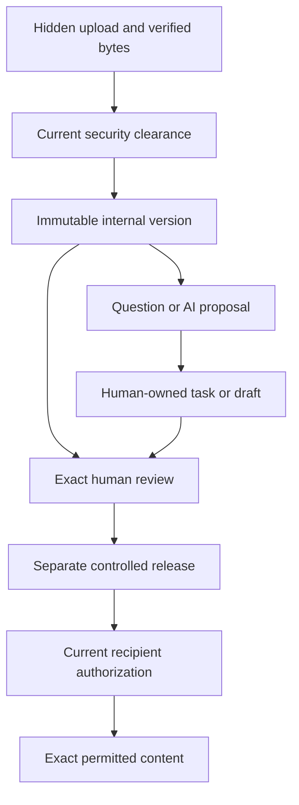

# MAP-06: Evidence, documents, communications and bounded AI

**Purpose:** make authoritative work traceable, deliver the right exact evidence to the right people, and route questions into accountable human decisions. Primary modules: M13 Documents, M14 Communications, M18 AI. Primary cross-cutting requirements: C02 Document integrity and C07 No-PHI/runtime AI. Dependencies include MAP-01 identity/security/audit, MAP-02 UX, MAP-03 technical work, MAP-04 commercial authority, MAP-05 context/reporting, MAP-07 adapters and MAP-08 verification.

**Edition:** 2026-10-09, America/Chicago. Canonical source baseline: `148d74d9720f0799e5d845bb789cd3fc3f43feb8`. This map distinguishes implemented synthetic source from target contracts. It neither activates real data nor proves live acceptance. `repo:` resolves within `reference/sources/canonical/`; `baseline:` resolves within `reference/`. Refresh actual source and provider state before executing a packet.

## 1. End outcomes, then the dependencies that make them true

| Outcome to work backward from | Required chain | User-visible proof |
|---|---|---|
| Client opens the approved report | Correct project/context → exact immutable bytes → required human review → authorized release → pinned audience → current access at byte request | Named document/version, usable permitted content, clear replacement/withdrawal behavior |
| Reviewer can defend the decision | Immutable source and checksum → exact assignment → current safe access → deliberate review decision → preserved evidence | Actual reviewed revision, reviewer authority, decision time and scope; changed draft has no inherited approval |
| Question reaches the right person | Permitted object/version → permitted participants → classified question → response owner → next action → accountable response | Thread remains in context, knows who owes a response and whether it was sent/failed |
| Client asks for a change without accidentally authorizing it | Message → routed clarification/task/change-request draft → owning workflow approval | Original approved work remains unchanged until its governed transition |
| Staff reduces clerical effort with assistance | Allowed source retrieval → bounded draft with citations/uncertainty → current authorized human review → deliberate adoption into a draft | Source-linked proposal, recorded adoption/rejection, no automatic professional/commercial authority |
| Record remains trustworthy during problems | Revocation/restriction/hold/withdrawal → independent current predicates → immutable history → safe recovery | Access stops where required, history remains, destruction is blocked by holds, failures are actionable |

These outcomes are the existing product scope, not new modules. Runtime AI remains an optional activated assistance path within M18; basic intake, scope, communications, documents and reporting must function without it. Do not solve an unfinished deterministic workflow by delegating its authority to a language model.

## 2. Source truth and present implementation boundary

| Area | Established by the frozen source/evidence | Still not established |
|---|---|---|
| Private ingest | Reservation, bounded transport, digest verification, synthetic security observations and human clearance contracts exist | Production file types/sizes, real scanner, safe inspection environment and complete real-data incident handling |
| Immutable versions | `private.document_versions` and exact grants/adoption; source object closed on successful adoption | Full logical-document creation/classification/relationship workflows for every business class |
| Internal content | Exact version/digest/recipient authority and separate gateway with before/after checks | Complete supported real-media preview/download experience |
| Human review | Exact synthetic assignment, request, attestation and immutable decision | Actual professional qualifications, live reviewer/controller delegation and real-user acceptance |
| Release | Exact version, separate controller, approved audience, replacement/history/withdrawal and released-content code | End-to-end hosted recipient bytes and launch-ready class/audience policies |
| Live observations in prior package | Fourteen migrations; three ACTIVE JWT-verified functions; private 65,536-byte `text/plain` bucket; zero observed lifecycle/object rows | A populated working document journey; configuration activation is not inferred from deployment |
| Verification in prior package | CI67 `37988716325` succeeded for canonical commit, including local database/unit/browser fixture checks | Hosted API/connected-browser jobs were skipped; concurrency/provider/real professional acceptance remain separate |
| Communications | Source module definitions and preparation fields specify object-linked communication | Complete operational threads, notifications, routing, external-event reconciliation and response ownership |
| Runtime AI | Historical roadmap and M18 include bounded assistance; current preparation UI says execution/retrieval/citations/adoption unconnected | Live provider processing approval or a working governed runtime service |

Sources: `baseline:00-reconciliation/RECONCILED_STATUS.md`, `baseline:00-reconciliation/SOURCE_REGISTER.json`, `repo:docs/03-data/ADR-003-PRIVATE-OBJECT-BOUNDARY.md`, the four document-version contracts named in the RPC table below, and `repo:docs/01-product/MODULE_MAP.md` sections 13, 14 and 18.

Some implementation notes say released-content deployment/tests were still pending. Later observations supersede those dated status statements: the extension is in the pinned source, deployed migration inventory and CI67. Its hosted lifecycle remains unaccepted. Do not interpret the old prose as missing code, and do not interpret deployment as completed delivery.

Hosted UI drift also matters: the prior Lovable inventory lacks canonical release UI/helper files and has older document components. Merge exact files deliberately with newer Spatial work. Never bulk-overwrite either tree. See `baseline:00-reconciliation/LOVABLE_SOURCE_COMPARISON.json`.

## 3. Authority is separated at each boundary

The diagram is conceptual, not a single persisted state column. Current adopted versions retain immutable `internal_draft`; review and release live in separate histories/projections. Do not mutate an immutable version to make UI badges match the diagram.

| Control dimension | What it establishes | What it cannot establish |
|---|---|---|
| Transport verification | Exact digest, byte count, media and finalized immutable object | Scientific truth, malware clearance, no-PHI review or client visibility |
| Malware/PHI observation | Result for a claimed current attempt and exact digest | Professional review; a synthetic observation is not a real scanner |
| Human security clearance | Exact current disposition under separate grant | Technical approval, content grant or release authority |
| Logical version visibility | Permission to bounded version metadata | Byte access, reviewing, signing or release |
| Exact internal content grant | Current permission to that version/digest | Recipient release or professional qualification |
| Review assignment and decision | Deliberate decision on exact revision by independently assigned actor | Release to any audience; general administration does not qualify someone |
| Release controller grant | Right to perform this exact governed release action | Technical qualification or automatic audience expansion |
| Current/historical recipient grant | Current permitted release visibility in its explicit mode | Internal draft access or other versions |
| Preservation hold | Blocks destructive retention cleanup | Automatic hiding, permission to distribute or permission to delete |
| Visibility restriction | Stops access under applicable current policy | Deletes bytes, clears a hold or erases history |
| Message or AI draft | Information, clarification or proposed next work | Scope, sampling, signed terms, cap, final release or scientific approval |

Source: `repo:docs/04-security/DOCUMENT_ACCESS_MATRIX.md`, `repo:docs/05-workflows/DOCUMENT_RELEASE_WORKFLOW.md`, `repo:docs/03-data/PRIVATE_OBJECT_CLEARANCE.md`, `repo:docs/03-data/DOCUMENT_VERSION_REVIEW_CONTRACT.md` and `repo:docs/03-data/DOCUMENT_VERSION_RELEASE_CONTRACT.md`.

## 4. IF-09: document lifecycle provider contract

MAP-06 provides this interface to MAP-03 deliverables, MAP-04 agreements/vendor/finance, MAP-05 passports/QBR, MAP-07 tool outputs and MAP-02 presentation. Where exact RPC names below exist, preserve their signatures. Broader logical contracts below are targets requiring an additive reviewed implementation. An authorized tool output still enters the document controls; it cannot bypass them by being generated internally.

### Action, input, state and storage map

| Capability/action | Actor and input | Authoritative store / returned output | Mutation and concurrency boundary | Present source versus target |
|---|---|---|---|---|
| Reserve private upload | Current authenticated subject with exact facility ingest capability; verified account/facility, idempotency key, declared size/type | `private.private_object_reservations`; safe object ID, derived state/revision/expiry | Server assigns identity/path/time; exact replay rechecks current access; changed request conflicts; expiry does not delete | Implemented synthetic; `repo:docs/03-data/PRIVATE_OBJECT_RESERVATIONS.md` |
| Transfer/finalize bytes | Verified current caller and exact reserved operation; bounded payload | `private.private_object_transports` plus private Storage object; verified SHA-256/size/type | Private gateway validates content; no caller storage coordinates or uncontrolled provider redirects; uncertain upload preserves exact intent | Implemented synthetic only; `repo:supabase/functions/private-objects/gateway.mjs`, `repo:supabase/migrations/20261008234953_private_file_transport.sql` |
| Inspect security status | Current uploader plus ingest entitlement or exact object grant and current scope | `private.private_object_security`; bounded status, no content/path | Status is observation, never an access token; missing and unauthorized share unavailable result | Implemented; `repo:docs/03-data/PRIVATE_OBJECT_CLEARANCE.md` |
| Observe scan / report suspected PHI | Trusted synthetic adapter for scan; currently permitted user for suspicion report | Immutable attempt/observation history; current security pointers | Rescan invalidates clearance; only current attempt can install result; suspected PHI narrows access and excludes AI | Typed fixture boundary implemented; real scanner/inspection target remains |
| Clear/reject object | Current human with explicit `clear_object`; exact digest/current scan, expected security revision, request/decision/reason | Immutable clearance decision and current security state | Malware failure/timeout cannot be cleared by this RPC; pass/no-signal remains quarantined until explicit clearance; false-positive handling preserves original signal | Implemented synthetic; live human/inspection policy remains gated |
| Set hold/restriction/close ingest | Separately authorized service control under current development contract | Security state and immutable audit; no content returned | Hold and restriction independent; closure one-way; no delete; narrowing must remain possible when access is removed | Implemented synthetic; production administration requires reviewed bounded actor path |
| Create/classify logical document | Authorized owning-domain actor; valid context/class/sensitivity and relationship | Existing `public.documents` identity with governed domain metadata; proposed class/relationship workflow | Same-account references and current authority; never derive authority from legacy release/version labels | Foundation record exists; complete governed creation/classification API is target, not assumed |
| Adopt object as immutable version | Human with current source entitlement plus explicit `view_versions` and `create_version`; object/hash/document and expected security/document revisions | `private.document_versions`, document head; immutable adoption receipt | Same scope, finalized safe digest and both compare-and-set revisions; mandatory audit and ingest closure in same transaction; one object/version binding | Implemented; `repo:docs/03-data/DOCUMENT_VERSION_CONTRACT.md` |
| List documents/versions | Current logical view grant with current identity/membership/facility access; bounded cursor | Permitted document/version metadata and next cursor | Lists 1–100; no hidden counts; new ordinal is not newest released pointer | Implemented metadata lists; product-wide discovery/search is target |
| Read internal exact bytes | Current logical view plus separate exact `view_content`, valid safety/gates; version/hash/request | Immutable content authorization/result records and verified attachment | Reauthorize before and after provider fetch with same intent; compare entire binding and digest/size/type; no signed bearer link | Implemented synthetic gateway; supported real media remains target |
| Request review | Current logical create/view actor; version/hash, expected document/review revisions, request ID | `private.document_review_requests`; `under_review` projection | One immutable request per version in current slice; CAS; fresh authority on exact retry | Implemented synthetic |
| Decide review | Exact active assignment and current exact-content access; request/hash/revisions/decision/attestation | `private.document_review_decisions`; approved_internal, changes_requested or rejected | One immutable decision; changed/rejected content requires new version; assignment retirement does not erase history | Implemented synthetic; actual qualification and sensitive-class policy gated |
| Prepare/release | Current exact controller with content/metadata scope; approved exact review; selected current-recipient grant IDs; all expected revisions and attestation | `private.document_releases`, release head; immutable metadata receipt and exact pinned audience | Atomic replacement pointer; no audience auto-expansion; original controller/recipient authority rechecked on retry | Implemented synthetic metadata; client product flow still incomplete |
| Read recipient bytes | Current exact approved current or historical recipient; release/hash/visibility/request | `private.document_release_content_authorizations/results/denials`; verified content | Separate recipient gateway; double current check, exact binding/integrity and mandatory result audit before response | Code/deployment/CI evidence exists; hosted recipient journey remains unproved |
| Withdraw/narrow release | Current controller with logical view/active scope, release revision and reason; trusted service fallback for narrowing | Immutable withdrawal, current pointer removal where applicable | No byte safety/content requirement for human withdrawal discovery; service retirement can work after gates/access removed; no old-version fallback | Implemented; current and superseded releases handled |
| Assemble document package | Authorized actor, permitted canonical version references and intended audience/context | Proposed package manifest referencing exact canonical versions; no independent copied authorities | Check each child at generation and access; current restriction/withdrawal cannot be bypassed by container export; define denied-child behavior explicitly | Existing M13/C02 requirement; no accepted runtime package implementation |
| Retain/archive/destruct when permitted | Authorized retention process, approved class schedule and exact policy version | Existing version/history plus future approved retention dispositions | Holds block destruction; archive/visibility separate; no invented retention duration or purge based on upload expiry | Requirement and OD-011 target, not a current destruction route |

### Exact implemented RPC families to reuse

| Family | RPC entry points | Source contract |
|---|---|---|
| Reservation/clearance | `reserve_private_object`, `private_object_status`, `private_object_security_status`, `report_private_object_phi`, `decide_private_object_clearance`, `provision_private_object_grant`, `revoke_private_object_grant`, `claim_private_object_scan`, `record_private_object_scan`, `set_private_object_controls` | `repo:docs/03-data/PRIVATE_OBJECT_RESERVATIONS.md`, `repo:docs/03-data/PRIVATE_OBJECT_CLEARANCE.md` |
| Immutable versions | `list_version_documents`, `list_document_versions`, `adopt_private_object`, `provision_document_version_grant`, `revoke_document_version_grant` | `repo:docs/03-data/DOCUMENT_VERSION_CONTRACT.md` |
| Internal bytes | `authorize_document_version_content`, `provision_document_content_grant`, `revoke_document_content_grant`, `record_document_content_result`, `record_document_content_denial` | `repo:docs/03-data/DOCUMENT_VERSION_CONTENT_CONTRACT.md` |
| Review | `provision_document_review_assignment`, `revoke_document_review_assignment`, `request_document_version_review`, `decide_document_version_review`, `document_version_review_status` | `repo:docs/03-data/DOCUMENT_VERSION_REVIEW_CONTRACT.md` |
| Release | `provision_document_release_grant`, `revoke_document_release_grant`, `release_document_version`, `withdraw_document_release`, `retire_document_release`, `document_version_release_status`, `document_release_audience_options`, `current_document_release`, `historical_document_release`, `document_release_withdrawal_status` | `repo:docs/03-data/DOCUMENT_VERSION_RELEASE_CONTRACT.md` |
| Recipient bytes | `authorize_document_release_content`, `record_document_release_content_result`, `record_document_release_content_denial` | Release contract's released-content extension and `repo:supabase/migrations/20261009194030_document_release_content.sql` |

Do not clone these into parallel release or approval services. Adapter callers must use their exact current signatures, including expected revisions and intentional request identity. Any needed signature change requires a versioned compatibility decision and affected consumer review.

### Essential exact-version and concurrency invariants

1. Persist server-authoritative actor, scope, ID and time. A recipient profile parameter is not the actor. System observations never impersonate a human.
2. Keep security, logical document, content, review and release revisions distinct. Each protects its own transitions. A receipt's original revisions are not current permission.
3. Exact retries bind complete original intent, including digest, expected revisions, audience and attestation where applicable. Reuse a request only for the same intent. Changed intent requires fresh deliberate preparation; an uncertain attempt is not rewritten to the latest revision.
4. Current scope and relevant grants are rechecked on retries and reads. A retired grant cannot be revived by replacing it with a new row and replaying the old request. Historical actions remain traceable.
5. Short ordered database locks cover authorization/transition/audit. Do not hold database locks across provider I/O. Mandatory audit failure rolls back the governed transition.
6. Keep direct application access to protected base tables denied, including service-role direct table privileges where the current contract denies them. Reuse checked functions and MAP-01 review; do not loosen ACL/RLS to make a UI work.
7. Metadata visibility, internal content, current release recipient and historical recipient are separate. Current audience is pinned to exact grant IDs. Later grants never silently join that audience.
8. A new draft/review leaves current release untouched. Only valid replacement release changes the current pointer. Withdrawn content does not restore a former release or inherit a same-version re-release right.
9. Current synthetic rule permits only `routine_synthetic_document` and strictly increasing released ordinals. This conservative development rule is not an invented permanent live re-release policy.
10. Each internal/recipient gateway reauthorizes before and after fetch; validates exact binding, digest, size and media; emits no bytes if integrity/auth/required observation fails. The current release route is `GET /document-release-content/{releaseId}/content?sha256={digest}&visibility={current|historical}`.
11. `response_prepared` means prepared by the trusted gateway. It never means delivered, downloaded, read, inspected, accepted or approved. Bytes already delivered cannot be recalled; a race after the last committed check cannot be described as atomic delivery cancellation.
12. Preservation hold prevents destruction but alone does not suppress visibility. A restriction blocks visibility independently. A narrowed/unsafe object must remain withdrawable through the authorized narrowing path.

Error mapping is precise but product copy remains readable: `28000` invalid provenance/authentication; `42501` unavailable/unauthorized; `22023` invalid input; `40001` stale revision/digest; `23505` changed idempotent intent; `55000` prohibited lifecycle/history transition. Foreign scope is denied before leaking digests/revisions. MAP-02 supplies presentation; MAP-06 preserves exact semantic distinctions.

## 5. Document user flows and missing launch capability

The internal library begins with title, owning work, purpose, class, current exact version and next action. Review begins with the real content, changes and current assignment. Client view begins with released title/date/version and permitted preview/download. Raw storage keys, UUID provisioning and frozen request internals belong in safe diagnostics, not the main product flow.

| User flow | Required target behavior | Remaining gap and handoff |
|---|---|---|
| Upload supporting evidence | Verified owning context, policy-allowed type/size, progress, resumable/exact retry as implemented, safe status and clear next actor | Current path is 64 KiB synthetic UTF-8 text. Real-media acceptance needs deliberate type/size, scanner, parser/preview and no-PHI handling contracts, not just a higher size constant. |
| Adopt into owning work | Select a permitted logical document and source; show current safety/eligibility; exact save confirmation | Complete logical-document creation/classification/owning-object linkage is required; no free-text references as authority. |
| Review technical deliverable | Exact content/version, visible change context, qualified current assignment, approve/request-changes/reject | Development `synthetic_fixture` qualification and attestation cannot be used as real qualifications. MAP-03 provides scientific/scope provenance; MAP-01 validates actor assignment policy. |
| Release to a client/audience | Clearly separate internal review from release; select actual eligible recipients and exact version; confirm operation and current state | Actual live classes/dual-role/audiences require OD-002/003/004/013 activation records. Do not auto-provision the owner as reviewer/controller. |
| Client opens exact report | Client-facing library with current metadata, separately authorized byte route and useful retry/denial | Existing metadata flags remain `metadata_only: true`, `released_download_available: false`; do not flip them to hide missing client integration. Implement actual separate byte availability/action and verify it. |
| Ask about document | Carry exact version, project/scope, author/reviewer context and permitted participants to IF-10 | A later version does not silently replace what the question referred to; questions cannot alter approval. |
| Replace or withdraw | Current/replacement distinction; historical access follows policy; fresh withdrawal remains available when unsafe | Test restriction/content-disabled state and superseded version. Maintain source receipt and denial behavior. |
| Publish packet/QBR/deliverable set | Manifest of exact canonical child versions; current per-child authority, completeness and policy-defined failure | Proposed safe default is all-or-nothing required-child delivery; never silently omit a required child or expose it. Record this engineering choice before implementing, not as an existing live policy. |

The full supported real-media policy is not inferred from Moldo limits or copied from an unrelated product. Use actual OS requirements and approved provider/data constraints. Preserve file/hash provenance through any preview transformation; a preview is not the original approved binary. Any transformed artifact needs an explicit relationship to its source and cannot silently replace the released version.

## 6. IF-10: communications and response ownership

M14 is currently a target workflow, not an accepted message service. The tables below are **logical design requirements**; physical table names/API endpoints must be chosen in the assigned additive migration and reviewed once. Reuse canonical account/object IDs and IF-01/02; no independent chat membership or authority model.

### Communication objects and actions

| Capability | Input / actor | Authoritative output and state | Safety, concurrency and failure rules |
|---|---|---|---|
| Open/create thread | Permitted account and linked existing object; optional exact document/version; classified purpose; authorized initiating user | Durable thread context, permitted participants, response owner, response state and server timestamps | Recheck each relationship and participant; no globally visible room by default; deduplicate exact creation intent |
| Read thread/history | Current account/object and participant entitlement | Bounded paginated authorized messages and attachments | Membership/assignment revocation denies new reads; no hidden participant counts or message previews; attachment needs independent IF-09 entitlement |
| Compose/send message | Authorized participant, deliberate content, exact thread/reply context and idempotency intent | Server-recorded message; distinguish accepted storage from provider notification status | Sanitize untrusted display; preserve draft on failure; exact retry creates one logical message; no content in generic security logs |
| Assign or route question | Current authorized router, classification, qualified eligible owner/queue and due/priority values defined by source workflow | Accountable response owner and auditable routing record | Recipient/owner lookup is permission-filtered; technical routing requires qualified reviewer; changed ownership CAS prevents silent takeover |
| Respond/resolve/reopen | Current responsible permitted person, deliberate response or state change | Visible response status, next actor and history | Reading, notification delivery and a client reply are not automatic approval or resolution; do not erase overdue/waiting work |
| Ask about document | Exact document version, scope/project context, author/reviewer references and permitted question | Version-bound thread/question with appropriate route | Source context persists after replacement; access to question does not grant the attached file; reply cannot update the report |
| Request changed work | Current authorized sender, referenced scope/cap/sampling/agreement/release and requested change | Link to owning MAP-03/04/06 draft/task with origin thread | No direct changes to approved records; owning module performs its own identity/revision/authority checks; one origin request does not duplicate changes on retry |
| Log call/external message | Authorized staff actor, actual event source/time observation and linked object; factual content | Logged observation with source/provenance; not fabricated provider delivery | Distinguish event time from server log time; neither call text nor manual “agreed” label is a signature or technical approval |
| Notify | Committed authorized domain event and permission-filtered recipient/content projection | Logical notification intent, provider attempt/receipt and bounded delivery/failure state | Use MAP-07 adapter and authenticated callbacks; current recipient eligibility/content minimization; duplicate callbacks do not resend/commit twice |
| Retry failed notification | Authorized bounded worker/operator and existing immutable notification intent | Additional attempt and current outcome | Do not duplicate source message, task, signature or release; retries bounded and visible; provider acceptance is not user reading |
| Handle inbound external content, if that channel is activated | Verified provider event, safely resolved sender/context and bounded payload | Untrusted candidate message/event for governed processing | Inbound text cannot issue tools, change authority or authenticate by display name. Apply agent-email-inbox skill if building an email-triggered action path. |

Minimal logical storage must preserve thread-to-object relationship, exact optional version reference, participant scope, message revision/history as policy permits, response ownership/state, notification intent/attempts, and provider event identity. Do not invent a content-retention period. MAP-01 supplies retention/audit and authorization primitives; OD-011 governs live retention policy. Message body and access-grant changes cannot be conflated in one unrestricted update.

### Routing must preserve separate authority

| Existing route/classification | Responsible workflow | Allowed output |
|---|---|---|
| Administrative | Authorized account/project support | Clarification, logistical response, assigned task |
| Technical | Currently qualified assigned reviewer in MAP-03/06 | Reviewed explanation or request for professional review; no unsigned scientific conclusion from an assistant |
| Scope/change | MAP-03 scope and MAP-04 commercial authorization | Proposed scope/change record and required review |
| Billing | MAP-04 finance | Permitted invoice/payment question or task; no technical disclosure merely because actor pays |
| Scheduling | MAP-03 operations | Proposed/authorized schedule change under current assignment/constraints |
| Urgent/incident | MAP-03 accountable incident/triage owner | Escalated action with visible ownership; no unapproved response-time guarantee |
| Complaint/dispute | Designated restricted route under existing policy/authority | Restricted review and response; no automatic broad client/vendor copy |
| Vendor | MAP-04 assignment owner | Assignment-specific clarification/evidence request or closeout response |

Source: `repo:REQUIREMENTS.json` M14; `repo:docs/01-product/MODULE_MAP.md` Communications section; `baseline:01-product/DOMAIN_AND_WORKFLOW_CONTRACTS.md`. Do not establish a new role per route. Resolve existing authorized people/capabilities and record actual delegation.

## 7. IF-13: AI proposal, source provenance and human adoption

### What was actually planned

The attached June 14 Master Map, section 12 Phase 6, lists AI classification, missing-information checks, document summaries, scope drafts, QBR narrative drafts, routing and internal search. It places AI after structured data/workflows and leaves final authority with people. Expanded archival workbooks contain additional candidate assistance, including field-note structuring and contractor comparison, with unanswered permission questions. Those candidates are not automatically approved enabled launch functions.

The current OD-014 record is `configured_for_development`, `production_enabled: false`, with approval fields null at the baseline. The general approved policy in Decision 008 allows AI proposals/drafts/reviews but does not identify a runtime provider or real-data sharing permission. The owner's current uncertainty must be reconciled in OD-014 before actual provider/real-content activation. This does not block other OS work or AI agents writing code under the development mandate.

Evidence: `baseline:01-product/AI_PROVENANCE_AND_BOUNDARIES.md`; `baseline:sources/extracted-originals/04-AuxiliumOS_Master_Map_and_Guardrails.txt`; `repo:docs/00-control/DECISION_LOG.md` Decision 008; `repo:OWNER_DECISIONS.json` OD-014; `repo:config/policy-defaults.json`; `repo:web/src/pages/module-surfaces.ts`; `repo:docs/03-data/WORKSPACE_PLANS.md`.

### Three different things

| Thing | Role | Dependency/authority |
|---|---|---|
| Development agents | Build, inspect, test and coordinate bounded source work | Existing development authorization and repo execution controls; not product business actors |
| Deterministic rules/smart prompts | Evaluate versioned known inputs and request appropriate review/information | MAP-01 configuration plus owning workflow; no language model required |
| Runtime AI | Retrieve permitted material and propose source-grounded text/classification | M18, OD-014 activation, current requester's access and deliberate human review/adoption |

### Bounded job lifecycle and logical storage

The following is a target, not an existing deployed API. Use the existing M18 concept of jobs, prompt versions, outputs and review decisions; do not create an autonomous agent operating system inside OS.

| Action/state | Inputs and authority | Durable output | Required failure/security behavior |
|---|---|---|---|
| Prepare eligible request | Current user, allowed function, exact permitted source IDs/revisions, purpose and configured limits | Proposed job request with source context and policy/prompt version | Reject inactive provider/function, prohibited data, unsupported scope or missing sources without leaking content |
| Retrieve permitted source | Current access and bounded source query | Exact citation manifest: source record/version, allowed excerpt/location and retrieval context | No cross-account results; current access before retrieval; untrusted source text cannot become instructions or capabilities |
| Queue/run bounded job | Explicit active policy/provider/data route and immutable job intent | Job identity, request provenance, provider/model/prompt versions, observed cost/time status | Bound time/tokens/cost/retries; actual limits are configured, not invented here; failure/cancel state visible |
| Produce proposal | Allowed retrieved content, explicit task and no authority tools | Output with citations, uncertainty/incomplete extraction, source/version manifest and review-needed state | No fabricated absent values, methods, rates, conclusions or citations; provider output is untrusted until validated |
| Review output | Currently authorized human with current access to the sources and target draft | Deliberate adoption/rejection/feedback record | Reviewer cannot review hidden sources; expired access blocks further reveal/adoption; retain safe historical provenance |
| Adopt allowed content | Exact output, currently permitted destination draft, expected destination revision and human intent | Owning-domain draft mutation plus linked adoption/audit record | No direct scope/sampling/cap/signature/release/permission change; stale destination requires reconciliation; exact retry creates one adoption |
| Fail/timeout/cancel | Job state and observed bounded provider outcome | Useful safe reason, attempts, cost/time visibility and next action | No endless spinner; do not duplicate paid/external actions blindly; no raw prompts/secrets in general logs |

Per-job provenance includes requesting subject/scope, exact input-source references and versions, function, prompt template/version, model/provider version as observed, status, output version, citations, uncertainty, observed usage/cost basis, human review/adoption/rejection and safe audit references. These logical fields do not authorize storing sensitive raw prompts indiscriminately. Retention/access follows MAP-01 and approved policy.

### Historically planned functions and controlled destinations

| Function | Allowed proposal benefit | Consumer and final authority |
|---|---|---|
| Intake classification / missing information | Suggest categories and gaps without rewriting original submission | MAP-03 triage human confirms |
| Document summary / extraction / internal search | Help locate cited information and flag incomplete evidence | MAP-06/current source owner; no hidden-source disclosure |
| Clarification draft / routing suggestion | Reduce repetitive composition and suggest a responsible route | IF-10 authorized person confirms recipient/content and sends |
| Scope draft / ROM assumptions | Organize proposed work/assumptions from allowed reviewed inputs | MAP-03 qualified scope review and MAP-04 independent commercial authority |
| QBR narrative | Draft source-based explanation for defined period/metrics | MAP-05 reviewed narrative and IF-09 release; no invented savings or compliance |
| Expanded-workbook candidate functions | Preserve reference for field-note/report structuring or comparisons | Explicit OD-014 function selection required before enabled launch commitment |

Permanent prohibitions: AI cannot approve professional scope/sampling/conclusions; sign; establish spending/caps; release reports; grant permissions; override qualification or no-PHI controls; state legal/coverage/medical/compliance conclusions as authority; invent service credentials; or deploy production independently. Source instructions embedded in documents/messages are data and may not select tools, widen access or override these rules.

A human “Adopt” click means only the explicitly supported draft change. Its text cannot cause the downstream domain to skip required approvals. Test prompt injection and inaccessible-source cases at the actual retrieval/adoption boundary, not by checking a warning string in the UI.

## 8. Provider/consumer boundaries across maps

| Interface | Provider → MAP-06 use | MAP-06 returns / consumer duty |
|---|---|---|
| IF-01/02 identity/context/capabilities | MAP-01 verifies active identity, membership, scope and explicit action rights | Document/communication/AI actions recheck current authority; no role-label shortcuts |
| IF-03 versioned configuration | MAP-01 supplies effective configured policy/default and activation state | Store applicable version with governed action; development choices stay visibly provisional |
| IF-04 directory | MAP-05 supplies permitted context relationships/names | Bind exact owning context and verify existence/relationship before mutation |
| IF-05/06/08 intake/scope/work | MAP-03 provides source records, revisions, assignments and technical deliverable context | IF-09 controlled evidence; IF-10 clarification/task links; AI proposal only if active |
| IF-07/11 commercial/vendor/finance | MAP-04 supplies exact agreement/signature/assignment/invoice source | Document represents source evidence, never creates authority by uploading a file labeled signed |
| IF-12 readiness/reporting | MAP-05 supplies passport/QBR source/period/metric definition | Controlled packet/version/release with child checks; comms retain originating context |
| IF-14 audit | MAP-01 supplies protected event/provenance contract | Bounded events atomically linked to consequential action; no raw secret/content dump |
| IF-15 adapter | MAP-07 supplies bounded scanner/storage/notification/AI provider mechanics where approved | MAP-06 owns document/message/job domain state and reconciliation; provider callback is observation, not human authority |
| IF-16/17 tool/Moldo | MAP-07 supplies authorized exact-source handoff | Preserve tool ownership and provenance; output enters IF-09; Moldo-only identity gains no OS access |
| IF-18 UI | MAP-02 supplies shared patterns/state/recovery presentation | MAP-06 implements feature screens with exact document/thread/job actions and real provider truth |
| IF-19 verification | MAP-08 supplies evidence levels and release gates | Return precise commit/profile/observed outcome with unverified limits; no blanket acceptance |
| IF-20 recovery | MAP-01 supplies authorized draft/recovery/session policy | Preserve allowed input and immutable operation identities without leaking data after revocation |

When another domain is not ready, implement a typed adapter/fixture only within an honestly labeled test mode. Contract agreement can unblock parallel work; a fixture cannot close full-stack acceptance. Do not introduce a second source of truth while waiting for the provider.

## 9. Bounded implementation slices and dependency order

These proposed children enter the canonical queue through the integrator. They are not a second live backlog. Existing code is reused and completed, not rebuilt because a new map exists.

| Slice | Required inputs | Bounded deliverable and non-goal | Completion evidence |
|---|---|---|---|
| MAP-06.S01 Reconcile existing source and evidence | Current branch/host inventory; baseline comparison; MAP-08 evidence rules | Preserve newer document and Spatial changes; correct stale notes; identify exact hosted prerequisites. No live business grants. | Readback hashes, affected diff, precise skipped/missing tests and next incomplete action |
| MAP-06.S02 Close synthetic upload-to-recipient journey | IF-01/02/04; deployed code/config securely verified; authorized synthetic fixtures | Real hosted upload, clearance, adoption, review, release, recipient bytes and withdrawal across explicit actors; compose current code instead of parallel services | Real Auth/API allowed and denied identities; actual Storage integrity; representative browser journey; targeted concurrent revocation/replacement checks |
| MAP-06.S03 Operational document experience | S02 plus MAP-02 context/recovery and IF-18 | Governed logical-document creation/classification/linkage, searchable library, exact review/release UI and recipient view; preserve personal plans | Domain relationship denials; page/cursor beyond first page; mobile/keyboard review; typed-reference impersonation blocked; metadata/bytes states truthful |
| MAP-06.S04 Real-media safety and activation path | Reviewed approved data/media requirements; MAP-01 no-PHI/incident/retention; MAP-07 adapter | Bounded production-capable media ingest/scan/preview and safe review path; no broad bucket/public-link shortcut | Allowed media integrity, malicious/mislabeled/oversize/provider failure/PHI quarantine, denied direct paths and observed safe inspection; affected OD activation records before real data |
| MAP-06.S05 Packages/history/hold behavior | S03; exact child manifests; approved class/history/retention configuration | Controlled packet assembly, replacement/history, archival/hold controls and useful withdrawal recovery. No invented purge schedule. | Restricted/withdrawn child cannot leak; concurrent child state changes handled; hold prevents destruction; history remains traceable |
| MAP-06.S06 Object-linked communications | IF-01/02/04, IF-08, IF-09 and MAP-02 patterns | Threads/participants, drafts/send/reply, response owner, routes and domain change-request handoff | Permitted/denied thread and attachment access, exact document context, no authority changes from messages, retry/conflict and visible waiting work |
| MAP-06.S07 Notification/provider reconciliation | S06; MAP-07 IF-15; existing source event contracts | Durable logical notification and bounded delivery attempts/callback reconciliation | Duplicate/out-of-order callback, revoked recipient, failed send, exact retry; no duplicate commitment; accepted/delivered/read correctly distinguished |
| MAP-06.S08 AI contract and inactive implementation | OD-014 provenance/choice state; IF-03/09/10/12; bounded test providers | Source/citation/job/review/adoption behavior with execution inactive for unapproved real content; deterministic core paths intact | Scoped retrieval, prompt injection, stale/hidden source, timeout/cost/failure and adoption permission tests; all prohibited authority paths denied |
| MAP-06.S09 AI live activation only if selected | Explicit affected OD-014 provider/functions/data permission plus MAP-08 gates | Activate only selected bounded assistance with real observations; retain normal human workflow | Provider/data/retention controls, end-to-end source review/adoption, cost/timeout and disable/recovery observations |

S06 can start once identity/context and thread-to-object contracts are stable; it need not wait for every file type or every domain module. S08 can develop against synthetic contracts while live activation remains unresolved; it must not delay the core launch journey. S05 and notifications must be complete where their original launch requirements apply. A selected activation gate blocks that affected real operation, not all engineering.

## 10. Exact source custody and allowed-path discipline

Semantic custody below is not a standing permission to edit every listed file. The lead issues a bounded exact allowlist. For an atomic cross-cutting fix, one writer may receive related files with the relevant custodian review; do not force serial handoffs solely because two maps consume the same contract.

| Area/path | Custodian and edit rule |
|---|---|
| `web/src/pages/private-files.tsx`; `web/src/components/private-object-upload.tsx`, `private-object-security-status.tsx`, `document-versions.tsx`, `document-content-download.tsx`, `document-version-review.tsx`, `document-version-release.tsx` | MAP-06 feature owner; follow IF-18. Shared shell/router/style changes through one allocated writer and MAP-02 review. |
| `web/src/lib/private-object-api.ts`, `private-object-security-api.ts`, `document-version-api.ts`, `document-content-api.ts`, `document-review-api.ts`, `document-release-api.ts` | MAP-06; preserve strict response/intent validation and existing exact retry semantics. |
| `supabase/functions/private-objects/`, `supabase/functions/document-version-content/`, `supabase/functions/document-release-content/` | MAP-06 domain gateways, mandatory MAP-01 security review; MAP-07 reviews actual external-provider adapter changes. |
| Existing private-object/document migrations and `docs/03-data/` contracts | MAP-06 semantic owner; past deployed migrations immutable. New additive migration identifier/order allocated by integrator; MAP-01 reviews ACL/RLS/provenance/locking and cross-scope invariants. |
| Generic identity/membership/capability/audit functions, runtime/auth, shared recovery policy | MAP-01 semantic custodian. Any exact shared-path edit must be allocated to one writer and reviewed; do not redefine generic authority inside a document helper. |
| Proposed new communications and AI feature files | MAP-06, in explicitly assigned names/paths. Physical schema and API names agreed in packet; current generic preparation components are not renamed into fake services. |
| Provider secrets, external adapters, webhook verification, adapter health | MAP-07 with MAP-01 security review; secrets only through protected configuration, never chat/source/artifact. Domain adoption remains MAP-06. |
| Shared tests/fixtures/config, package/lockfile, deployment, canonical root control files | Integrator controls allocation/merge and MAP-08 gate review. Feature test files can be exclusively assigned; do not race another agent's shared fixture. |

## 11. Focused proof and launch boundary

Reuse existing relevant evidence when source/environment inputs match. Current database tests use real PostgreSQL semantics through PGlite with simulated Auth; unit tests inject providers; fixture browsers do not exercise RLS. None substitutes for actual hosted Auth, private Storage reads or two-session target behavior. Do not discard useful local proof just because it is not the final gate.

| Risk | Minimum meaningful affected evidence |
|---|---|
| Wrong account/identity, inactive membership, retained old grant | Real database/API denial with direct and UI-independent attempts; no identifying data leak |
| Wrong digest/version, stale expected revision, changed request intent | Exact targeted regression for immutable binding/CAS/idempotency; original intent and original receipt preserved |
| Concurrent permission/safety/replacement change | Actual independent target sessions around authorization/transition; gateway tests around before/after provider checks; record known post-check race limit |
| Review/release confusion | Separate reviewer/controller/recipient actors and grants; old/new same-hash versions; no approval inheritance or auto-added audience |
| Hold/restriction/withdrawal | Hold alone preserves visibility where allowed and blocks destruction; restriction blocks content; unsafe content still discoverably withdrawable |
| Recipient file | Actual authenticated byte request with integrity verification; no storage-key/token disclosure; direct object routes deny; metadata success alone not accepted |
| Package child leak | Restricted, withdrawn or unauthorized child at generation/access; no stale container bypass |
| Communication authority | Message requests changed scope/cap/sampling/release; only a linked draft/task results; exact document context retained |
| Notification uncertainty | Duplicate/out-of-order provider events and bounded retry; one logical message/event; no false read/delivery claims |
| Runtime AI | Inaccessible source, malicious instruction in document/message, missing citation, stale target, canceled/failed job and prohibited transition tested at real boundaries |
| Usability | Actual internal review and client document/question journey on supported phone/desktop/keyboard; no hidden current source or lost drafts |

The work packet returns exact commit/paths, schema/provider dependencies, observed commands/results, evidence levels, source/class/actor cases, remaining limitations and canonical queue/state updates for the lead. Preserve failing evidence with diagnosis; never delete history to make a test pass. No full-suite repetition without changed risk or a required gate.

MAP-06 is finished when all original M13/M14/M18 and C02/C07 acceptance is fulfilled at the applicable approved activation scope, the complete document and communication journeys work with current access, provider failures/retries are accountable, and AI either meets its explicitly selected activation contract or has an explicit owner-approved requirement/timing disposition. An unselected provider does not automatically mean M18 is complete. Record that decision rather than silently removing the module.

Existing live gates remain OD-001 role/delegation, OD-002 reviewer/controller/dual-role, OD-003 audience, OD-004 replacement/history, OD-011 retention, OD-013 no-PHI/safe inspection and OD-014 runtime AI. This map adds no owner approval, person, rate, scientific threshold, retention duration or external provider. The integrator and MAP-08 determine full OS release readiness from canonical evidence, not a document count or green UI badge.

## Canonical acceptance accountability

The following exact criteria belong to this map. Axx is a reference alias for the ordered criterion in the pinned `repo:REQUIREMENTS.json`, not a new live requirement ID or a completed-status claim. Preserve all required evidence levels in the source. Collaborating maps and hashes are in `coverage/ACCEPTANCE_OWNERSHIP.json`.

### M13

- **M13.A01** — uploads begin hidden.
- **M13.A02** — classification, exact version, owning context, required approval and recipient permissions are checked together before release.
- **M13.A03** — authorized viewers/downloaders receive only the approved version.
- **M13.A04** — direct object URL/API attempts respect access restrictions.
- **M13.A05** — new drafts cannot inherit old release approval.
- **M13.A06** — superseded/withdrawn records have explicit access behavior.
- **M13.A07** — holds prevent destructive retention cleanup.
- **M13.A08** — packages cannot disclose a restricted child document.
- **M13.A09** — Document packages reference canonical versions rather than duplicating independent copies; technical drafts are not treated as released final reports.

### M14

- **M14.A01** — every thread is linked to an account/object.
- **M14.A02** — participants and notification content honor the same access model.
- **M14.A03** — messages have ownership and response status.
- **M14.A04** — technical questions route to qualified reviewers.
- **M14.A05** — calls and external messages can be logged without changing approved records.
- **M14.A06** — requests for changed scope/cap/sampling/releases create drafts or tasks.
- **M14.A07** — failed notifications are visible and retryable without duplicate commitments.
- **M14.A08** — Ask-about-document questions retain exact version, scope, author/reviewer and project context; administrative, technical, scope, billing, scheduling, urgent, complaint/dispute and vendor routes keep separate authority.

### M18

- **M18.A01** — each output records source context, prompt/model version and resulting review status.
- **M18.A02** — AI respects the user's access.
- **M18.A03** — source content is treated as data rather than system instructions.
- **M18.A04** — uncertain or incomplete extraction is visible.
- **M18.A05** — adoption/rejection is recorded.
- **M18.A06** — AI proposes and drafts but cannot grant professional scope, sampling, signatures, caps, final release or technical conclusions.
- **M18.A07** — jobs have failure/cost/timeout visibility.

### C02

- **C02.A01** — Review approval binds to the exact immutable revision and checksum; a changed draft loses that approval.
- **C02.A02** — Creating a replacement draft leaves the released version current until controlled replacement release.
- **C02.A03** — A package cannot expose restricted child files; direct storage access is denied without current audience authorization.
- **C02.A04** — Preservation holds block destruction separately from visibility restrictions.

### C07

- **C07.A01** — Suspected PHI is quarantined and excluded from AI processing under the already-decided no-PHI posture.
- **C07.A02** — Untrusted documents and messages cannot supply agent instructions or elevate permissions.
- **C07.A03** — Runtime AI outputs carry sources and review state; technical sign-off remains an authorized human action.
