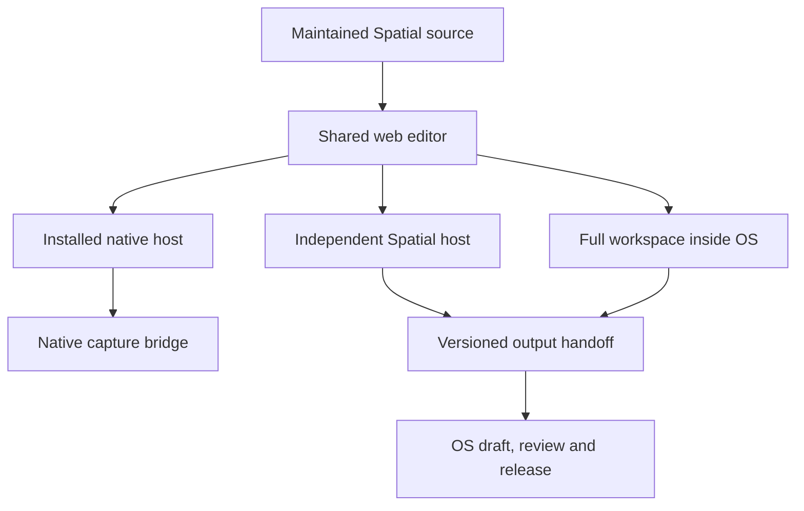

# Tools, integrations, Spatial and Moldo

Map ID: MAP-07. Accountable requirements: M20 and C06. Collaborators: MAP-01 identity/security/audit, MAP-02 experience, MAP-03 authorized work, MAP-04 commercial authority, MAP-05 enterprise context/reporting, MAP-06 evidence/release and MAP-08 verification.

The end goal is useful tool access with durable, authorized handoffs. A person opens the correct tool in context, knows where work is saved, preserves its source and returns a reviewable output to the right OS workflow. An independent tool remains independently usable. An integration cannot duplicate authority, silently widen access or make ordinary work depend on an unrelated system's availability.

This map preserves existing tool capabilities and source. It does not propose a new integration platform, select paid services, create additional business roles or assert that an endpoint in a specification is deployed. Source evidence is the embedded reviewed snapshot; refresh actual source/provider state before implementation.

## Source and current-versus-target boundaries

| Source | What it establishes | What remains a target |
| --- | --- | --- |
| `repo:docs/03-data/ADR-001-DOMAIN-AND-MOLDO-BOUNDARIES.md` | OS/Moldo ownership, explicit commercial responsibility, scoped projections, independent operation and versioned connector behavior | Actual current Moldo adapter and real cross-system journeys |
| `repo:docs/01-product/MODULE_MAP.md`, M20 | Existing integration categories and prohibition on bypassing core permissions/authority | Provider selection and useful implementation for each accepted category |
| `repo:web/src/pages/spatial.tsx` | Current OS wrapper and personal synthetic browser boundary | Authorized project/server/recipient integration |
| `spatial:spatial-source/SOURCE_SNAPSHOT.json` | Packaged Spatial source at `fc3a9b212e2a43b8a4fb41dbc6790ad3710279ba` | Proof that this remains the current independent tool head |
| `spatial:web/src/spatial-generated/SOURCE_MANIFEST.json` | Generated editor provenance and exact asset hashes | Exact current OS/standalone deployed bundle parity |
| `spatial:spatial-source/contracts/COMPATIBILITY.md` | Geometry/scene version evolution, local export profiles and constraints | A live receiver supporting every local export profile |
| `spatial:spatial-source/contracts/publication.openapi.json` | Proposed reserve/finalize/status wire contract | Implemented, deployed and accepted OS receiver; live publication remains unestablished here |
| `spatial:spatial-source/contracts/capture-bridge-v1.md`, `capacitor/README.md` | Native bridge, packaged host and explicit physical-device obligations | Verified owner-usable installed app and device acceptance |
| `coordination/OWNER_DIRECTION_UPDATES.md` | Owner requests `spatialauxilium.io`, independent hosting and preserved full workspace inside OS | Actual DNS/hosting/access/deployment state |

The older canonical OS snapshot and newer packaged Spatial snapshot differ deliberately. Maintain the editor in its owning source and regenerate its OS/standalone outputs. No manual fork of the generated bundle is a maintainable completion strategy.

## Working backward from finished capabilities

| Capability | Authoritative input and result | Governing logic and failure handling | Acceptance and owning handoff |
| --- | --- | --- | --- |
| T01 Open a permitted tool | Verified person and account/site/project/area context; output is a tool launch with explicit context and mode | Revalidate current membership/action; a URL parameter or shared email grants nothing; denied/stale context has a useful return path | IF-01/02/04/08/18; permitted and denied launch, then correct return to the same work |
| T02 Know where work lives | Tool's canonical document/revision and local/server state | Local draft, saved local revision, uploaded bytes, server acceptance, professional review and client release are separate facts | IF-16/09; reopen proves the named persistence state; label pending/uncertain/conflict accurately |
| T03 Independent Spatial web access | Maintained editor source served at the owner-requested domain with its actual access policy | Separate hosting must not depend on an active OS page; protected data still requires authorization; auth/session handling is explicit across origins | Independently open the domain, use the workspace and reopen work; OS embedding still works; no claim from route-only fullscreen mode |
| T04 Full editor inside OS | Same maintained editor and schemas, wrapped with permitted context | Preserve the working 2D/3D direction; avoid duplicate editor implementations; isolate tool layout from shell without losing context or controls | IF-18/16; real embedded edit/save/reopen/export at phone and desktop, not a screenshot of a sample model |
| T05 Native capture handoff | Bridge capability result and completed canonical geometry with retained source | Browser capability failure is honest; cancellation/denial/storage/alignment failure preserves existing work; imported capture cannot overwrite corrected geometry silently | IF-16; physical supported iPhone captures, returns, saves and reopens; unsupported browser explains the actual path |
| T06 Recover local work | Persisted draft/revision, original source association and explicit copy/import intent | Crash/background/lock or a failed export cannot masquerade as successful cloud save; no broader server authority from a local lease/hash | Native/web persistence and interruption tests at their actual layer; device acceptance remains separate |
| T07 Adopt an output into OS | Exact source revision, document/area association, frozen bytes/manifest and current destination authority | Reserve before transfer; verify stored bytes/schema/revision/current grant before acceptance; acceptance creates internal draft evidence, not audience release | IF-15/16/09; permitted round trip, revoked authority, malformed package and retry after uncertain response |
| T08 Review and deliver output | Internal accepted draft plus owning review/release rules | MAP-06 owns review and recipient bytes; tool UI cannot release through its own shortcut or expand original source audience | Exact version/reviewer/audience retrieval and withdrawal; original geometry/provenance preserved |
| T09 Exchange Moldo work | Explicitly mapped OS enterprise context and Moldo engagement identity, with per-field ownership | Moldo accepts or rejects its own engagement request; OS does not rewrite Moldo's daily workflow, scope or native commercial truth | IF-17; actual current peer schema reviewed, explicit scoped round trip, no implicit OS membership |
| T10 Display useful cross-system status | Authorized source state, source revision and freshness | Unknown or stale sync is visible; totals/last activity cannot silently assert current facts; duplicate/out-of-order events do not roll back newer state | IF-12/17; trace displayed metric/state to permitted source and reproducible event handling |
| T11 Survive disconnect/revocation | Current connector/user/source-grant state and retained essential records | Ordinary Moldo work survives OS outage; revoke identity and connector separately; destination never widens source access; permitted export/separation remains possible | C06; outage, disable, revoked user, re-enable/reconcile and final-version export scenario |
| T12 Add an already-planned adapter | Existing user outcome, approved category, source owner and exact contract | Adapter invokes domain validation; no direct side-door writes or provider-selected business policy; external acknowledgment is not completed commitment | IF-15 plus owning interface; duplicates, invalid callbacks, partial failures and current permission denial |

T01-T12 are map references for existing outcomes, not added application modules. The appended requirement section preserves the exact canonical acceptance criteria. Its coverage rows assign shared criteria to their accountable maps.

## Interface ownership

This map produces IF-15 adapter envelopes, IF-16 Spatial context/output and IF-17 Moldo exchange. It consumes IF-01 identity/context, IF-02 capability decisions, IF-03 effective configuration, IF-04 directory context, IF-06 scope/sampling, IF-07 commercial authority, IF-08 project/task state, IF-09 document lifecycle, IF-10 communication delivery, IF-11 vendor/finance, IF-12 readiness/reporting, IF-14 audit, IF-18 UI action/view and IF-20 data lifecycle/recovery.

Only the owning domain can finalize its business transition. MAP-07 validates the external transport, schema, source identity and exchange semantics, then submits the permitted intent to that domain. MAP-01 reviews access; MAP-06 reviews content/recipient handling; MAP-04 reviews commercial callbacks. MAP-08 reviews the real-service evidence.

## Spatial delivery topology

This diagram describes intended delivery paths and ownership, not proven current deployment. Independent access and OS integration must both work. Native-only delivery would omit the requested full web workspace; a web preview cannot prove native capture. A separate domain must not create a second independently maintained editor.

### Standalone hosting sequence

1. Inspect the actual Spatial repository/head, active work, build outputs and current owner-requested domain configuration. Confirm which assets are generated and which source owns them.
2. Build the independent host from the same accepted editor source. Define the actual authentication/data boundary: personal local work, account-bound work and protected project outputs must have explicit behavior. A public static frontend is not permission to expose OS data.
3. Verify origin/callback/deep-link handling and login/logout recovery for each actual entry path. Sharing a parent brand does not make browser storage or cross-origin sessions shared. Do not place service credentials in the browser or transfer bearer authority through an arbitrary URL.
4. Configure the authorized host/domain without overwriting the OS project's newer work. A hosting limitation must be reported concretely; do not infer a paid upgrade or weaken access to avoid it.
5. Read back the actual deployment identity and test independent access, persistence and the same editor capabilities. Verify the embedded OS path on its own candidate. Record intended differences, such as authenticated project context versus a personal workspace.

No step requires the owner to debug a build as the final product delivery. The implementation team must prepare the usable deployment/install path and identify only the protected account/signing/device steps that actually require the owner.

### Native capture and export contract

The pinned native bridge is version `1.0.0`. `AuxiliumCapture.capabilities` accepts its explicit bridge version and reports availability/reason; availability does not establish that permissions were granted. `capture` returns the canonical document and `nativeSourceRetained: true` only after durable save/reopen. Cancellation, permission denial, storage failure, incompatible bridge and failed alignment must not substitute fabricated geometry.

The web consumer validates the returned geometry and cannot overwrite an edited existing document ID. Native raw scans/world maps remain protected and excluded from ordinary exports. The installed bridge accepts bundled `capacitor://localhost` main-frame calls under the actual native policy. This is not a browser-accessible RoomPlan API.

`AuxiliumFiles.saveExport` takes the explicit bridge version, safe basename, admitted MIME type and exact frozen bytes. The pinned source admits JSON, ZIP, SVG, GLB, PDF and PNG up to 32 MiB decoded. It returns an actual completed/cancelled result from the native share activity. A successful local export does not imply upload or destination acceptance. Use the actual current bridge contract if the source has advanced; do not silently widen the pinned bounds.

Physical-device acceptance includes capability/permission prompts, completed multi-room capture as supported by current source, interruption/alignment recovery, reopening retained work, device lock/background handling, WebKit persistence protection, touch interaction, export cancellation and actual save delivery. Simulator, portable geometry or unsigned compile evidence cannot substitute for those claims. Source: `spatial:spatial-source/contracts/capture-bridge-v1.md`; `spatial:spatial-source/capacitor/README.md`.

### Versioned geometry, source and output handling

Retain the 1.0 schemas and existing documents. Geometry/scene 1.1 add explicit area semantics under the pinned compatibility contract. Unknown versions are rejected, not guessed. Local all-floor export profiles are distinct from the proposed publication exchange. A multi-floor local export does not establish that a live receiver supports it.

The copy-provenance profile preserves original geometry bytes and source identity/hash while assigning a new document identity to the explicit copy. Its source association survives editing, undo/redo and reopen. Importing a copy cannot silently replace corrected work. Hashes prove byte identity, not professional accuracy, permission or release.

The OS-side receiver must specify admitted profiles, bounded sizes, manifest/path validation, exact digest/identity, whether generated derivatives are admitted, and what is quarantined. Do not treat an SVG/PDF/GLB wrapper as trusted merely because a manifest exists. Reuse existing content validation and document controls. Extend the wire contract only through a reviewed versioned change when the actual outcome requires it.

### Proposed publication transaction

The packaged OpenAPI contract describes reservation, finalization and status. It is a proposal, not a receipt that a receiver is live. Preserve its semantic boundaries when implementing:

| Action | Before | Success | Failure/retry |
| --- | --- | --- | --- |
| Reserve | Current destination/action authority; exact immutable source identity and request ID | Bounded upload instructions and reservation; no client release | Same intent replays safely; changed content under same request ID or stale revision conflicts |
| Transfer | Reserved exact payload and allowed destination | Transport receipt only | Retry exact bytes; partial transfer is not accepted evidence |
| Finalize | Actual stored bytes and manifest; current authority; schema and expected revision | Exact source revision/digest accepted as an internal draft | Pending checks remain pending; revoked grant, mismatched content/revision or invalid package cannot finalize |
| Query status | Current authority to inspect the intended result | Truthful accepted/pending/failed result and exact destination/revision | A timeout triggers status reconciliation before a new intent; unauthorized result is concealed/denied |
| Review/release | Internal accepted version and domain prerequisites | MAP-06 exact review and audience release workflow | No adapter shortcut, inherited approval or expanded audience |

Do not hardcode the proposed REST paths into a new client before reconciling the actual receiver implementation. If the existing application uses a compatible typed RPC pattern, settle the exact adapter contract with MAP-06/MAP-01 and update its specification once. Do not maintain two competing publication protocols.

## Moldo exchange

| Information | Source owner | OS use | Forbidden assumption |
| --- | --- | --- | --- |
| Enterprise account/program/portfolio entitlement | OS | Minimal authorized assignment context | This creates Moldo or OS business authority automatically |
| Moldo appointments, engagement execution and field findings | Moldo | Permitted status/reference projection | OS may rewrite native work or alter measured facts |
| Contracting party, signer, billing and authorization | Explicit per engagement | Trace correct commercial responsibility | OS T&M assumptions replace Moldo's actual commercial model |
| Technical report/review provenance | Originating qualified workflow | Only properly reviewed/released source version within source audience | Destination can expand source grant or release an unreviewed report |
| Executive metric/QBR | OS projection | Reproducible source references and visible sync freshness | Aggregate access is broader than underlying permitted data |
| User and connector access | Each application | Explicit scoped mapping and independent revocation | Shared email, staff title or integration creates OS membership |

Before implementation, inspect actual current Moldo source/contracts and access. This package contains no full Moldo repository. Freeze the relevant peer contract and identify the field/action owner. A source catalog that mentions Moldo is not evidence of exchanged data.

Each exchange identifies contract/schema version, source system and object, source revision, target mapping, event/request identity and correlation. Reject unsupported payloads and unassigned contexts. Duplicate messages are idempotent; late older messages cannot roll back current state. Retry policy must be bounded and observable; reconciliation exposes missing/conflicting facts to a responsible operator. A failed notification or sync must not repeat a commercial commitment.

The disconnect scenario must show ordinary Moldo work continuing, OS freshness becoming truthful, access remaining bounded, permitted exports retained and re-enable reconciliation completing without duplicates. Sharing rights, separation/export obligations and real commercial relationships remain under OD-016. The map does not decide corporate structure or future sale terms.

## Other existing integration categories

| Category already in the product map | Owning business interface | Minimum adapter responsibility |
| --- | --- | --- |
| E-signature | IF-07 | Verify genuine callback/source; bind exact version and permitted signer; replay safely; do not equate delivery with effective authorization |
| Accounting | IF-11 | Transfer approved operational records; stable external IDs; reconcile retries/status; do not create a replacement accounting product |
| Email/SMS | IF-10 | Current authorized recipient/channel/template; useful delivery/failure status; no sensitive preview leakage or duplicate commitments |
| Calendar | IF-08 | Preserve assignment and scheduling authority, time/context and cancellation semantics; do not infer mobilization from event creation |
| CMMS | IF-08/12 | Map authorized site/work context and source ownership; prevent two mutable masters for the same field |
| Lab/vendor | IF-06/11/09 | Preserve specimen/custody/assignment identity and revisions; imported evidence does not become professional interpretation or client release |
| External document storage | IF-09 | Preserve owning version and source audience; external link does not bypass current access/release rules |

Implement only a selected adapter that closes an existing prioritized outcome. Do not buy or activate every category because it appears in the list. OD-015/016/017 and the relevant professional/commercial/content decision apply only to the affected live action.

## UI action and failure map

At launch, show tool name, permitted context, working mode and a clear return action. Within the tool, give the canvas/workspace useful space and place persistent context/save state where it can be understood without development diagnostics. Keep personal examples out of an operational record unless deliberately entered.

During save/export/sync, distinguish unsaved, pending, confirmed, uncertain, conflicted, denied and unavailable. Use the shared UI contract's semantic states, not a universal green badge. Preserve work through retries and explicit copies. A revoked grant must block protected operations without pretending the local data became officially released. State exactly what remains recoverable and where the user should continue.

Empty means there are no permitted records; an unconnected adapter, failed query or unsupported platform must not be shown as an empty successful workspace. Unknown external freshness must not look current. A disconnected integration should point to the actual responsible operator or local independent workflow, not produce an endless spinner.

## Bounded implementation slices

| Slice | Ready inputs | Work | Handoff evidence |
| --- | --- | --- | --- |
| T-S1 Current source and topology | Fresh tool/OS refs, active writers, owner direction | Reconcile source manifests and identify independent host plus embedded entry paths | Exact source/bundle map, intended differences and accepted access boundary |
| T-S2 Standalone and embedded editor | Accepted shared source/build and IF-18 | Complete independently hosted entry at the requested domain and preserve full OS editor | Real open/edit/save/reopen/export per entry; current deployed identity |
| T-S3 Native capture delivery | Actual bridge/source, signing/device route available through protected process | Produce owner-usable install path and full capture-return-persistence behavior | Actual supported-device evidence with explicit remaining limitations |
| T-S4 OS context/output adoption | IF-01/02/04/08/09 pinned; receiver contract accepted | Implement exact source/destination/version transaction and recoverable status | Permitted/denied real round trip, malformed payload, retry/conflict and review handoff |
| T-S5 Moldo minimal exchange | Actual peer contract, field ownership and synthetic environment | One complete scoped request/status/released-output exchange | Duplicate/out-of-order/revocation/outage and independent operation evidence |
| T-S6 Selected external adapter | Concrete prioritized user outcome and owning domain contract | One useful provider handoff with bounded errors/reconciliation | Real scoped exchange and no bypass of owning-domain controls |

T-S2 and T-S3 do not wait for every enterprise module to finish. T-S4 needs real context and document authority. T-S5 requires the actual peer contract, but its design can proceed without blocking a separate Spatial repair. This is a dependency map, not an unsupported schedule or completion percentage.

## Writer boundaries and completion

MAP-07 is the custodian for adapter code and the reviewed tool packaging/handoff. The independent Spatial source owner writes its canonical editor; the OS integrator applies the generated package and wrapper under an exact allocation. Do not let OS UI and Spatial workers both edit the generated directory. The lead alone coordinates shared router/lockfile/root state and target publication unless explicitly delegated.

Every adapter returns its actual changed files, source/destination revisions, interface decisions, tests, real deployment state and first missing claim. Completion requires the relevant original M20/C06 acceptance and the specific user outcome, including current authority and failure recovery. Screenshots, a generated asset, an external success receipt or a live domain alone cannot close the complete integration.

If an instruction or source is unresolved, record the exact missing piece and continue independent authorized work. Do not choose an unprotected shortcut, invent a provider capability or ask the owner to reapprove an already authorized ordinary engineering step.

## Canonical acceptance accountability

The following exact criteria belong to this map. Axx is a reference alias for the ordered criterion in the pinned `repo:REQUIREMENTS.json`, not a new live requirement ID or a completed-status claim. Preserve all required evidence levels in the source. Collaborating maps and hashes are in `coverage/ACCEPTANCE_OWNERSHIP.json`.

### M20

- **M20.A01** — each connector declares record ownership, allowed operations, external identity mapping and version.
- **M20.A02** — least-privilege credentials are server-controlled.
- **M20.A03** — events/retries are idempotent.
- **M20.A04** — ordering/conflicts/partial failures and reconciliation are visible.
- **M20.A05** — changes still use domain authorization/release/audit rules.
- **M20.A06** — sync cannot expose drafts or overwrite approved scope.
- **M20.A07** — connector revocation and export/offboarding are supported.
- **M20.A08** — staff and Moldo-only managers operate in Moldo without OS access; authorized Auxilium managers see permitted operational projections in OS; enterprise clients see only released/allowed Moldo information scoped to their account/portfolio; scoped enterprise assignments can enter Moldo without requiring Moldo staff to use OS; Moldo ordinary operations survive OS unavailability; integration can be removed without destroying Moldo's essential records.

### C06

- **C06.A01** — Moldo-only staff and managers have no OS membership by integration alone.
- **C06.A02** — OS outage, connector revocation, duplicate or out-of-order messages do not corrupt or stop ordinary Moldo operations.
- **C06.A03** — Enterprise clients and group managers see only their authorized and appropriately released projection.
- **C06.A04** — Per-engagement commercial owner, data owner and identity mapping can be exported and reconciled without merging databases.
